# Creating a New Company Catalog
Learn how to efficiently manage your B2B offerings by setting up a new catalog within your Shopify admin dashboard. This guide walks you through the configuration steps to organize your products and pricing for specific company locations.

1\. Navigate to [Shopify Admin](https://admin.shopify.com/store/friga-bohn-spares-store)

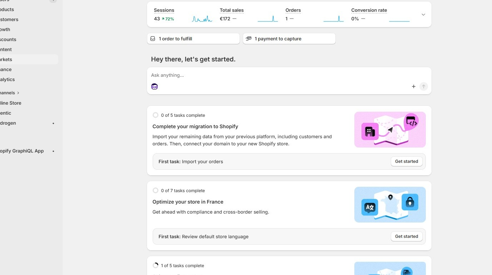

2\. Click **Markets**

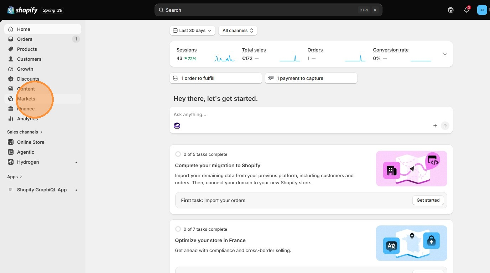

3\. Click **Catalogs**

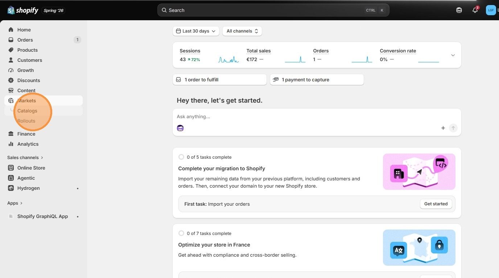

4\. Click **Create catalog**

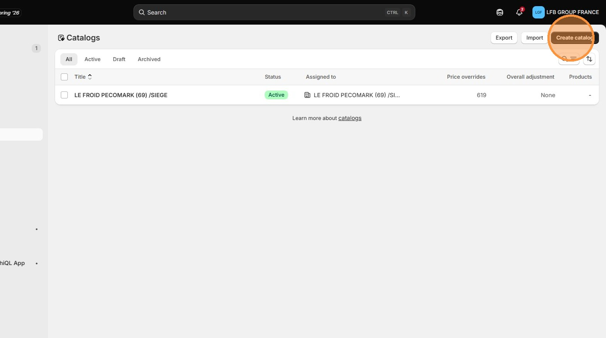

5\. Add the **Title**.

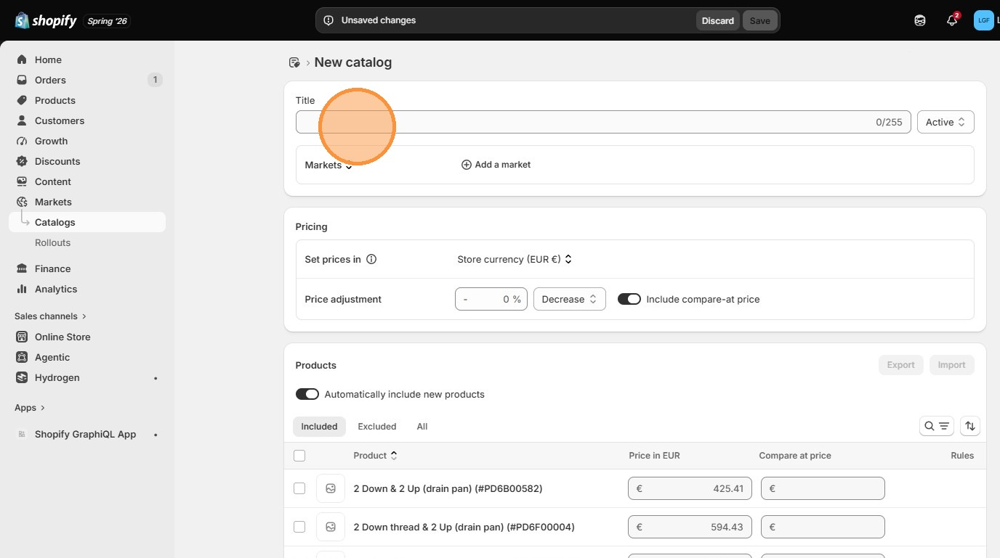

6\. Click this icon to change target to **Company locations**

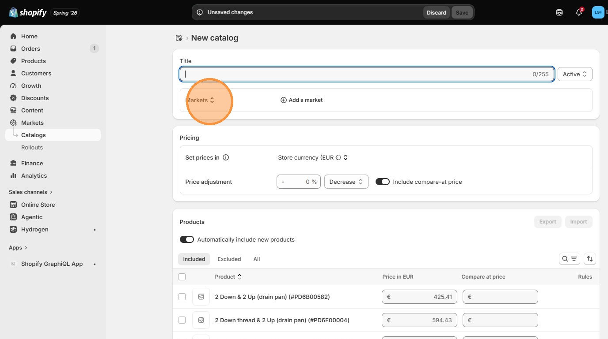

7\. Click **Company locations**

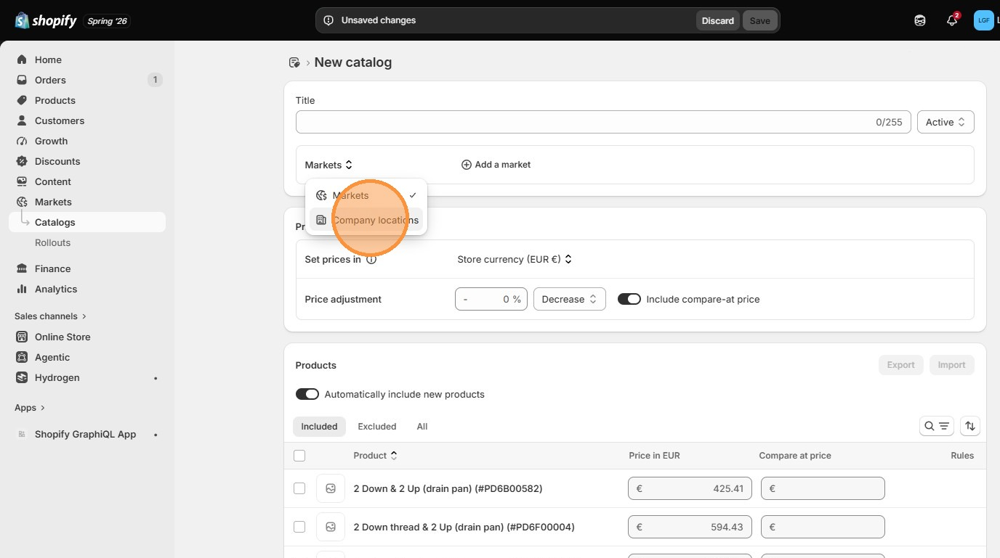

8\. Click **Add a company location** and add all company locations that follows this catalog

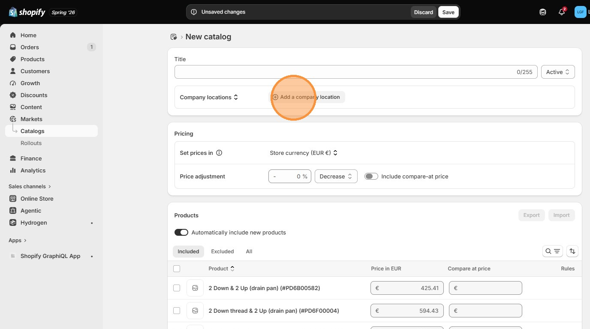

9\. add to the **Overall adjustment** field for entered percentage discounts for all included parts

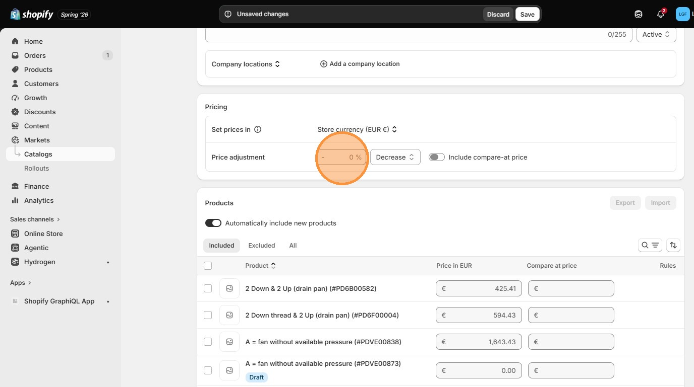

10\. For different pricing of products or groups of products, add adjusted prices for each part.

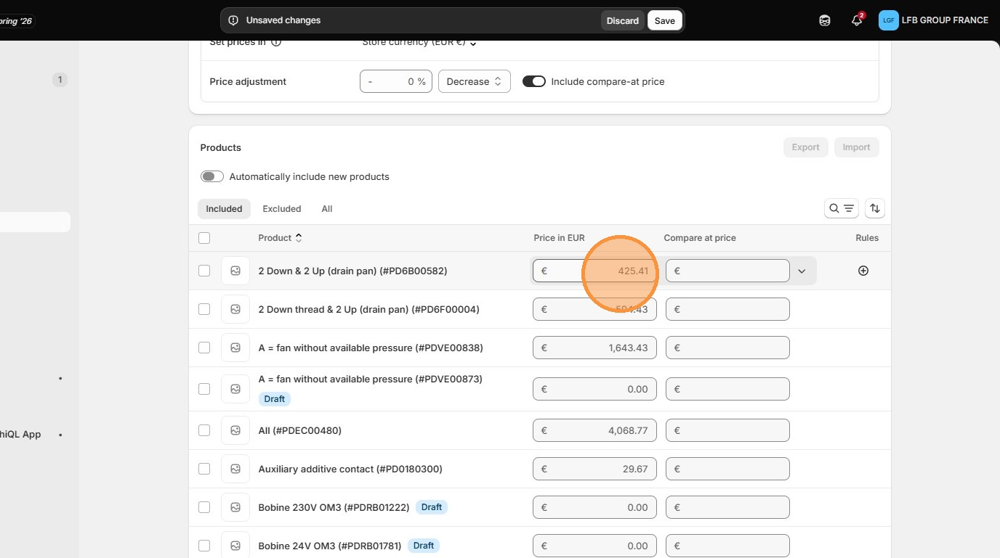

11\. Click this icon to search for parts.

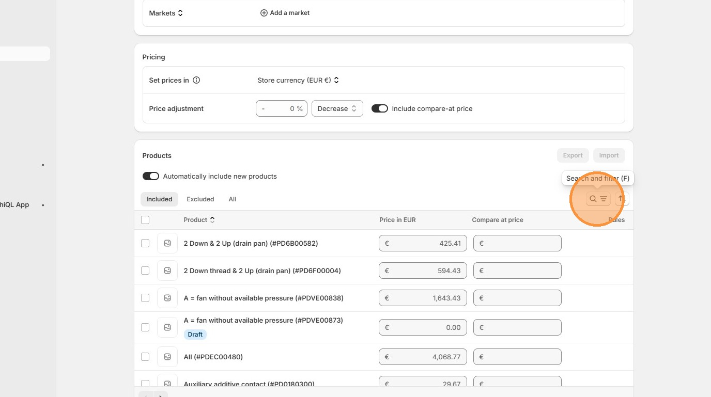

12\. Type Part Code to search for parts

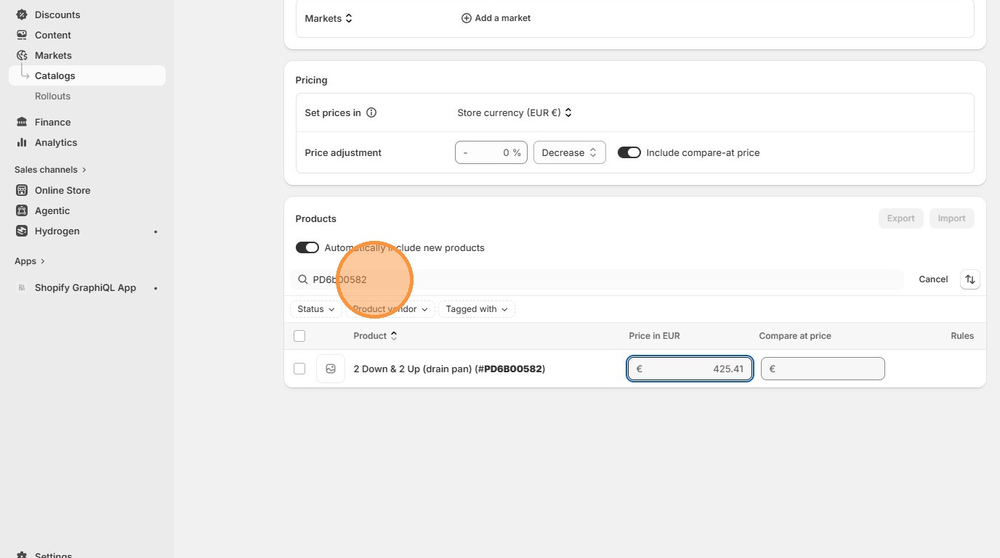

> ↑ [Go back to Shopify Admin](../shopify-admin.md)