# Managing Company Details and Catalogs in Shopify
Learn how to update company metadata and manage restricted catalogs within your Shopify admin panel. This guide will help you streamline B2B operations by configuring customer-specific locations and pricing visibility.

1\. Navigate to [Shopify Admin](https://admin.shopify.com/store/friga-bohn-spares-store)

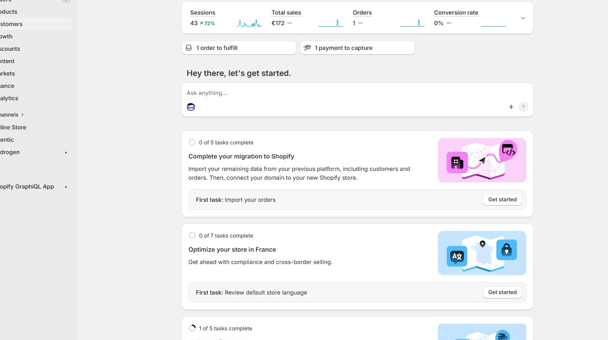

2\. Click **Customers**

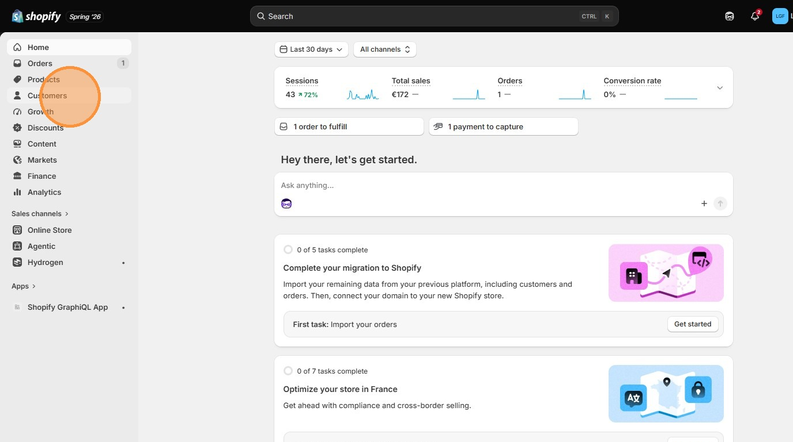

3\. Click **Companies**

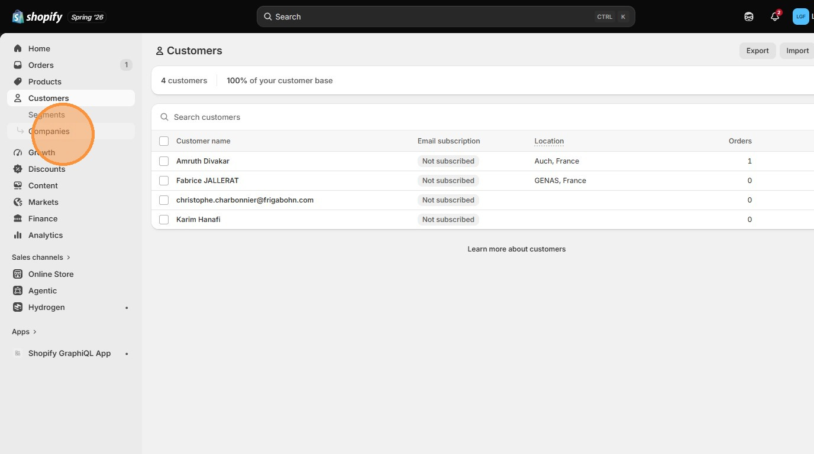

4\. Click on a company to edit

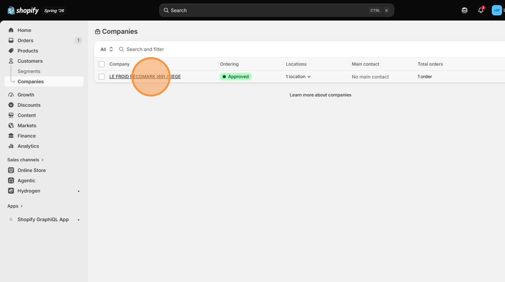

5\. Click this icon for options to update company details

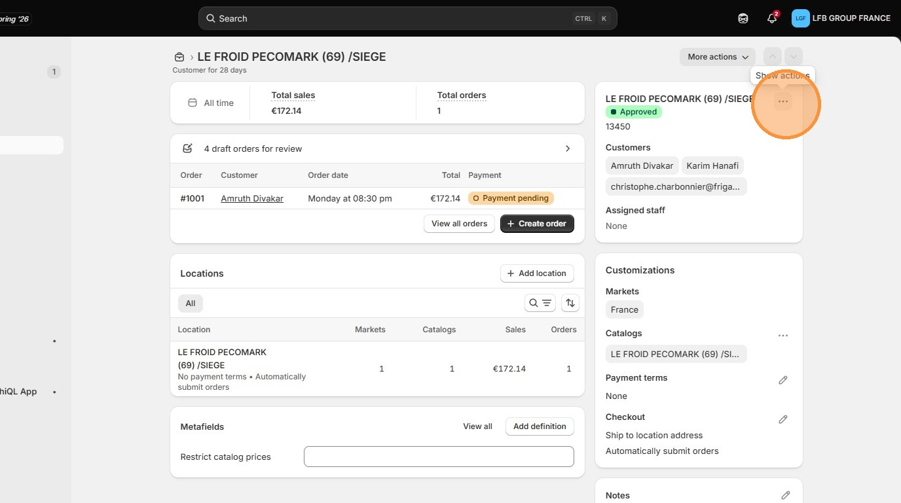

6\. You have options to 

- Edit company details
- Manage permissions
- Add/remove customer to company, etc

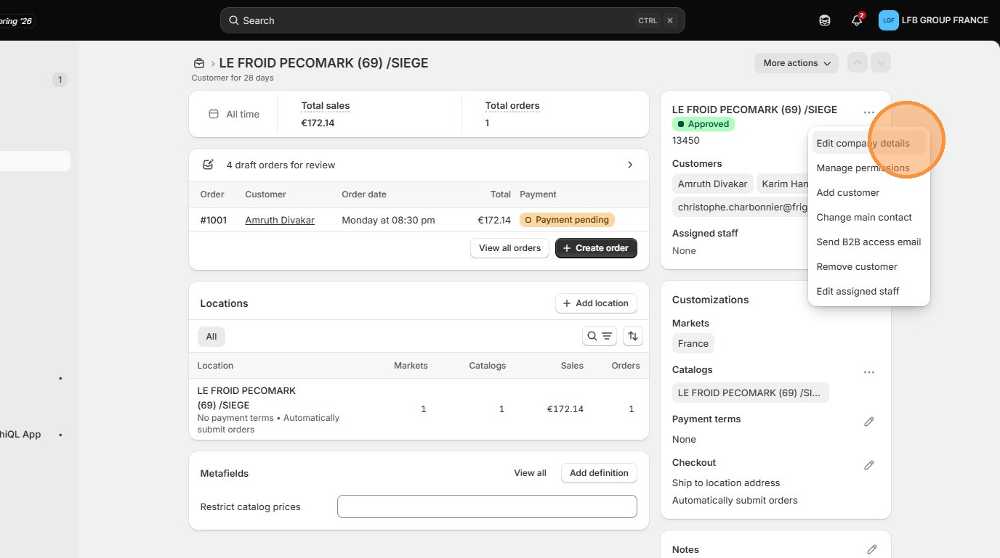

7\. Click this icon to add/remove price catalogs

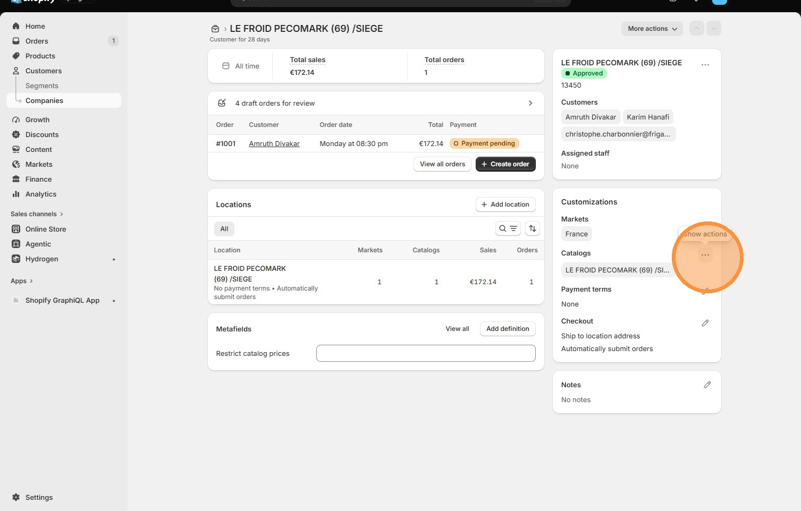

8\. Edit **Restrict catalog prices metafield** to restrict catalog price visiblity to Distributor admins only

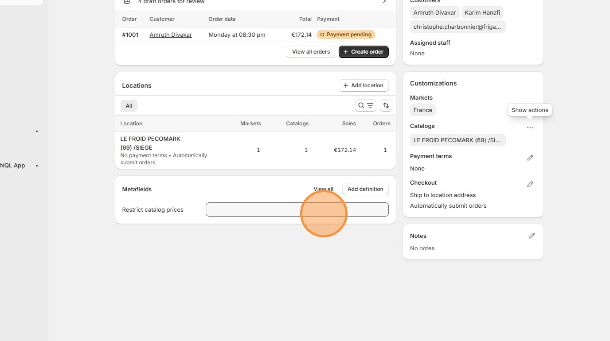

9\. Click **Add location** to add new location or click on a location to edit

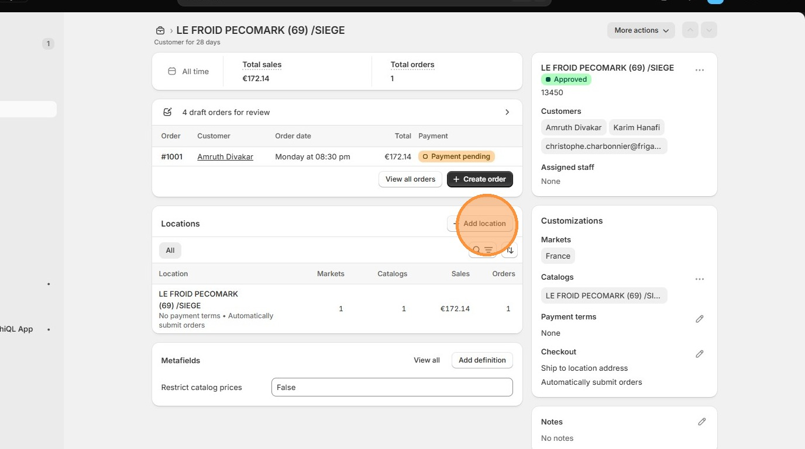

10\. Edit the **Location name** field.

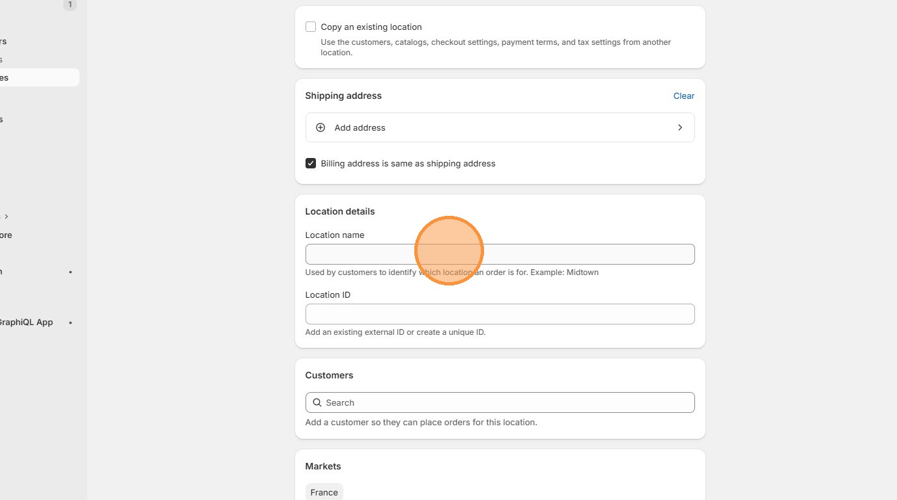

11\. Edit the **Location ID** field.

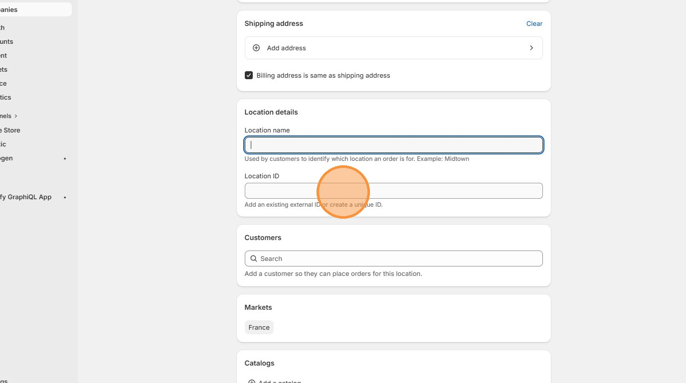

12\. add customers to location using the **Customer search** field.

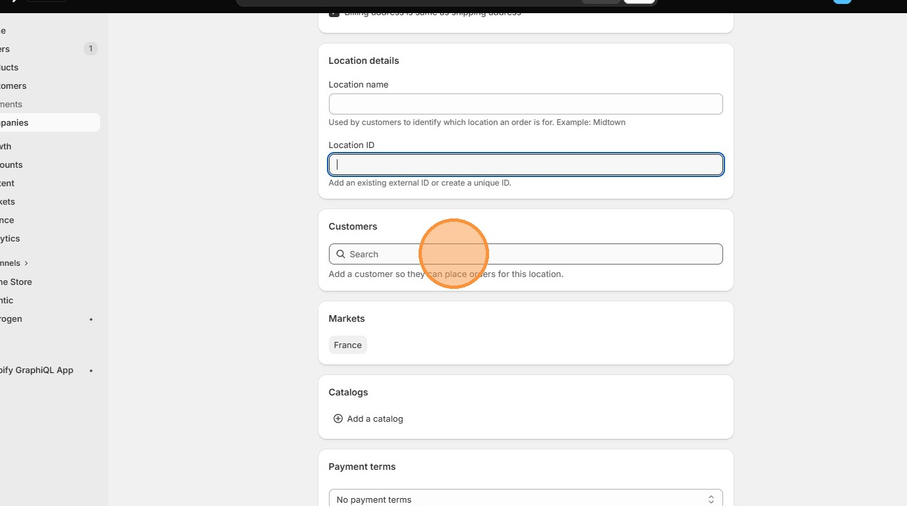

[Go back to Shopify Admin](../shopify-admin.md)