# Managing Customer Contact Information and Roles in Shopify
Learn how to efficiently update contact details, job titles, and administrative roles for your customers within the Shopify admin dashboard. This guide simplifies the process of managing customer profiles and account permissions to ensure accurate business data.

1\. Navigate to [Shopify Admin](https://admin.shopify.com/store/friga-bohn-spares-store)

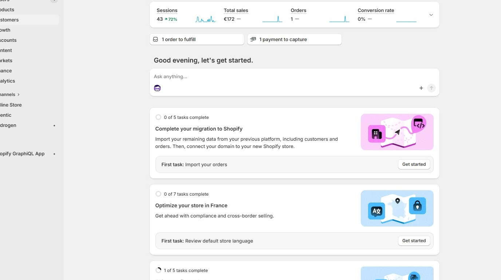

2\. Click **Customers**

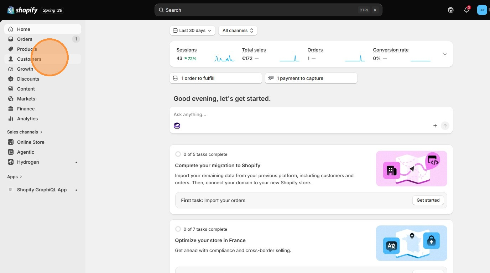

3\. Click on a customer to edit

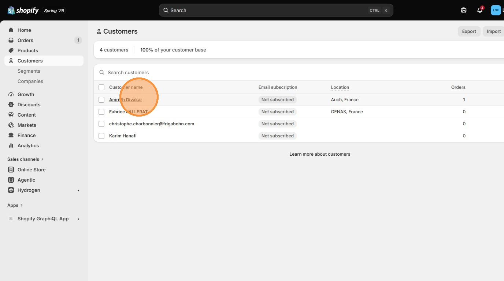

4\. To edit customer details click here

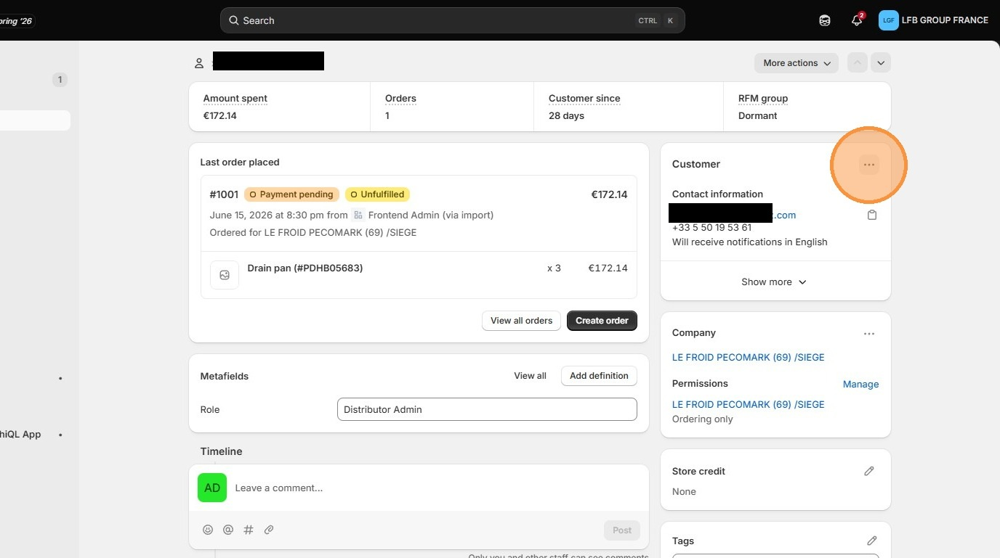

5\. Click **Edit contact information**

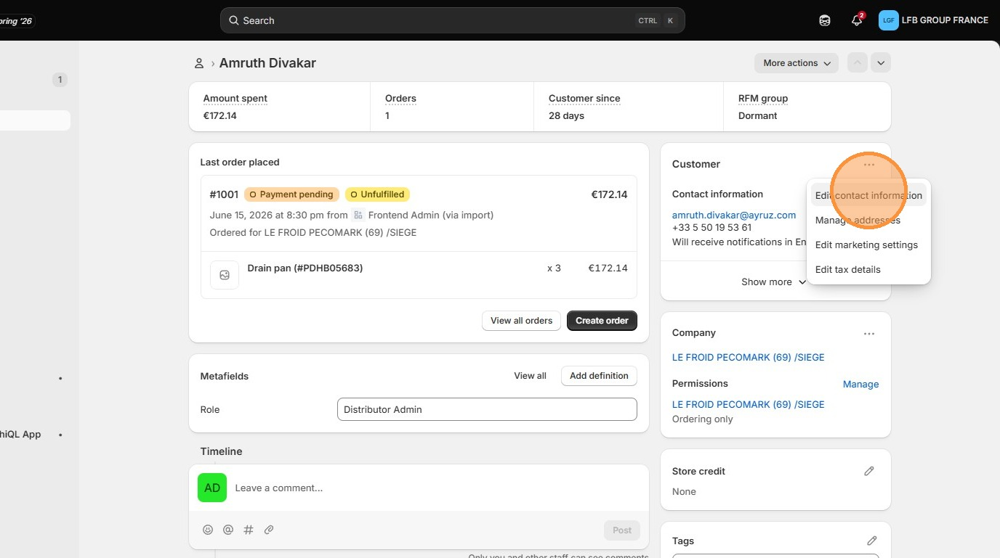

6\. Update the customer information here

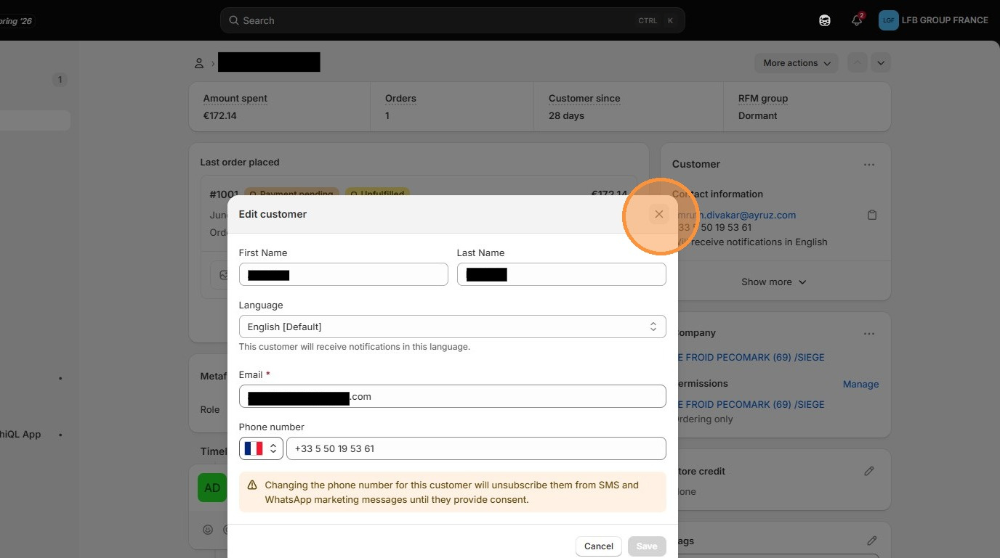

7\. Click **Manage addresses**

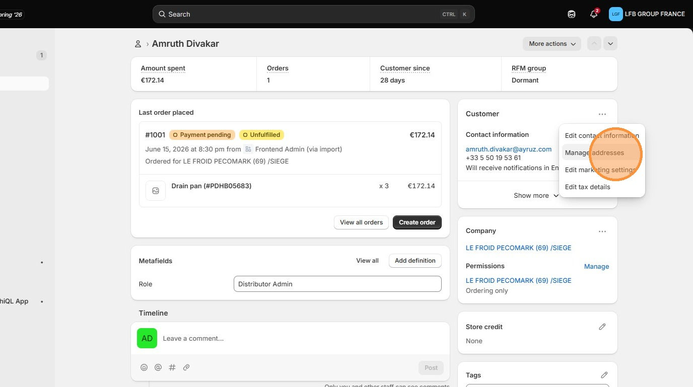

8\. Click this icon to update customer's address

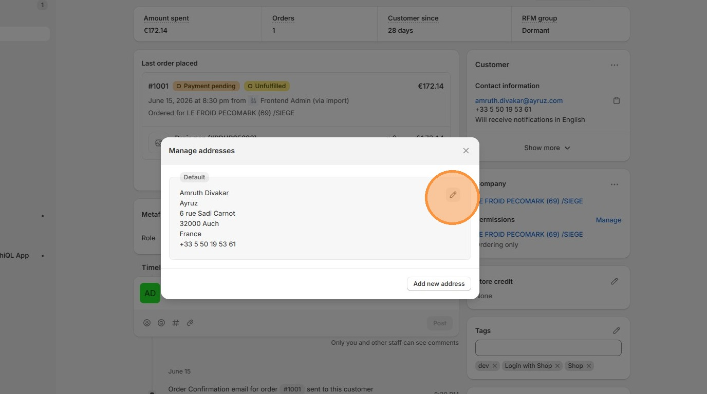

9\. 

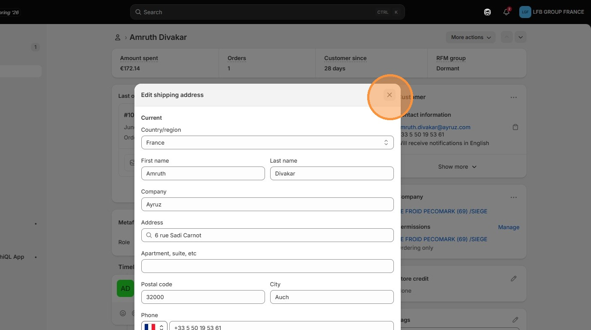

10\. Click this icon to edit company options, like add or remove customer from company

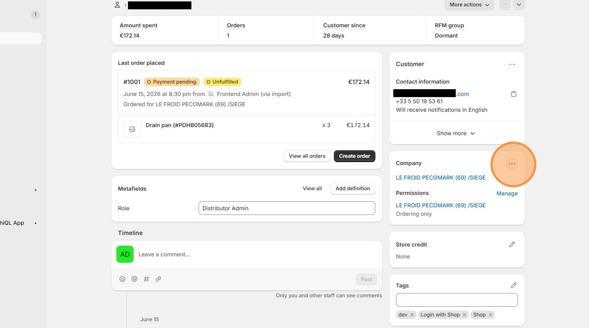

11\. Click **Manage** to update the company locations assigned to customer

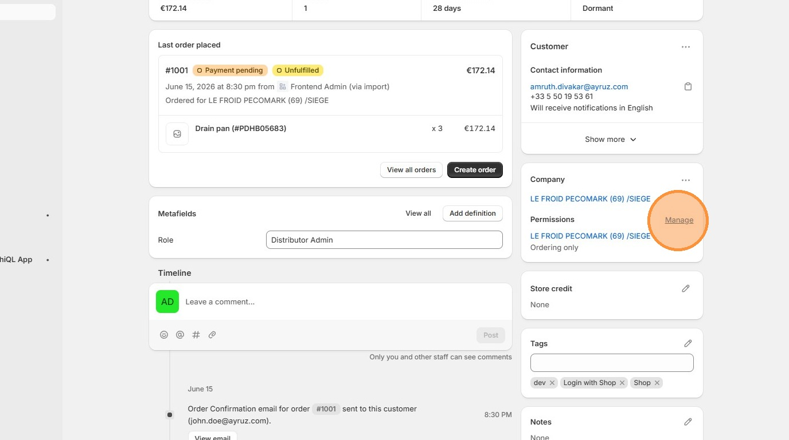

12\. Add or change company locations (only add one location per customer)

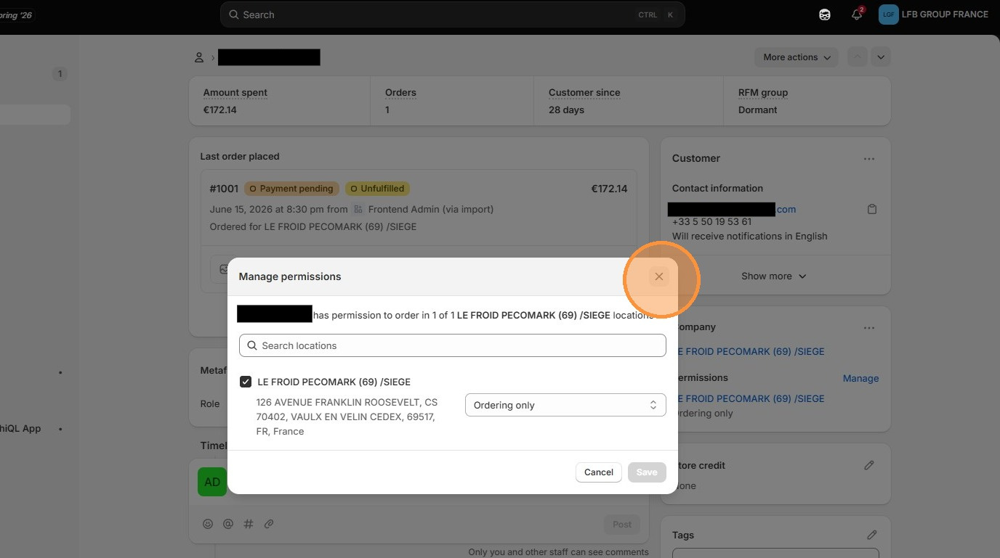

13\. Click **Roles** selector to update customer role

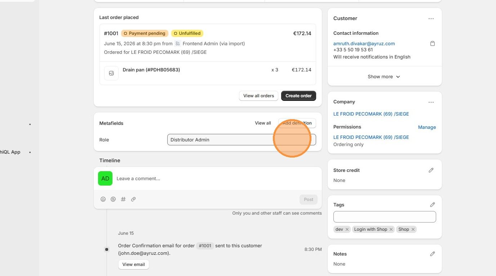

> ↑ [Go back to Shopify Admin](../shopify-admin.md)