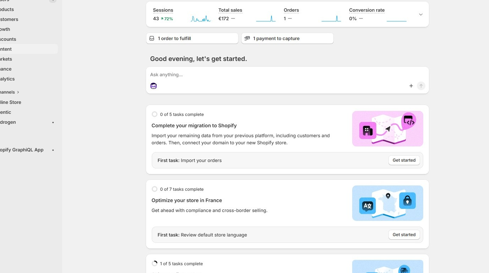
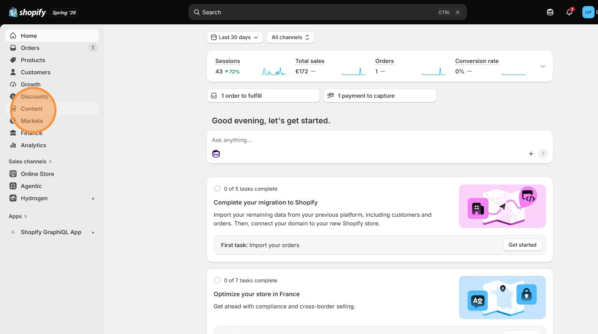
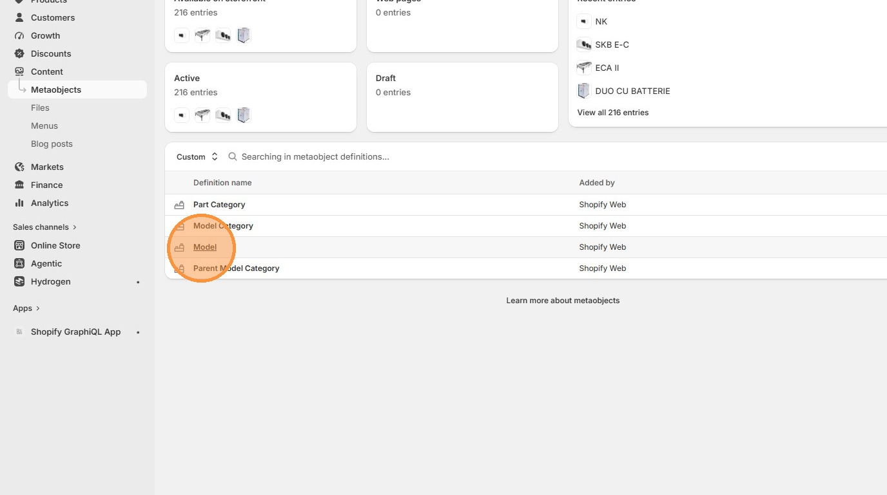
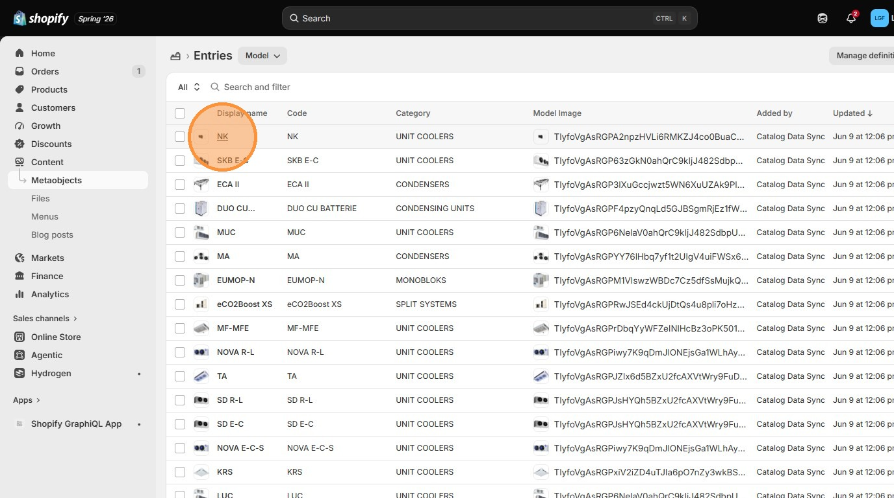
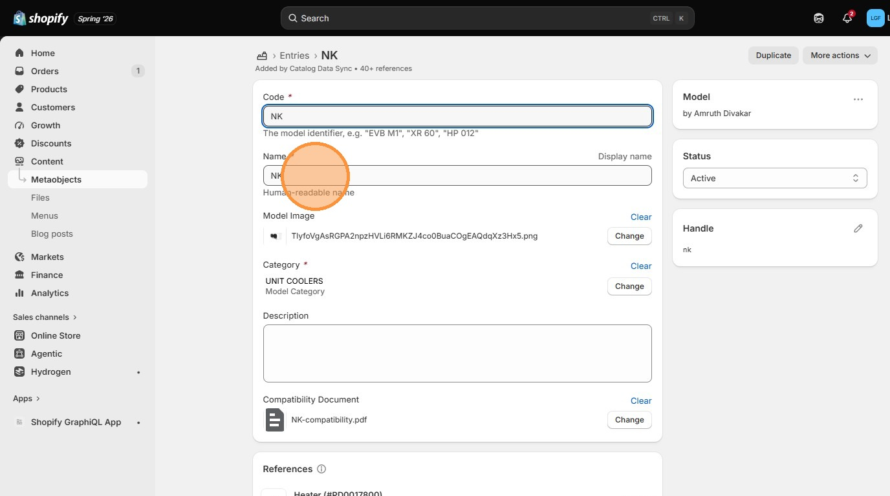
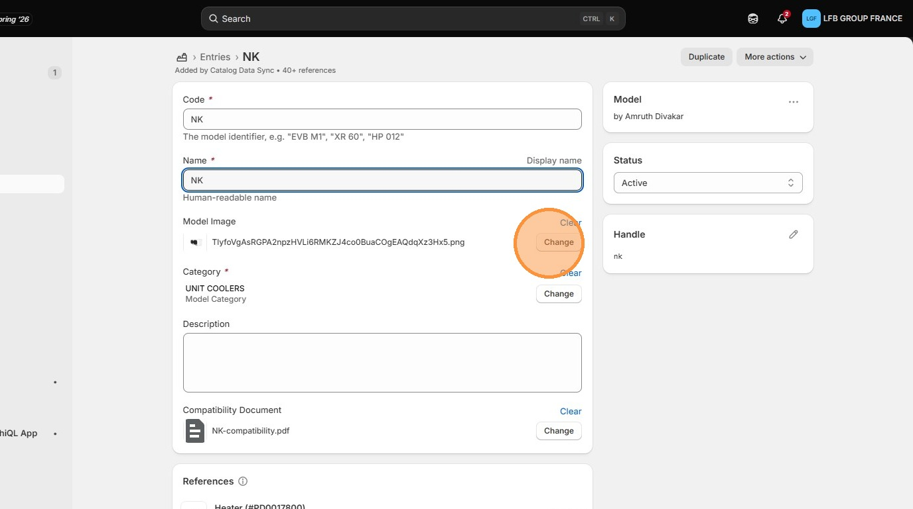
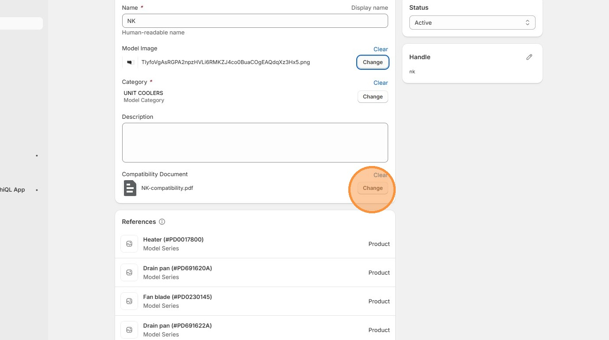

# How to Edit Models in Shopify Admin
Learn how to access and modify specific data fields within your Shopify store's custom content models. This guide simplifies the process of updating code and naming conventions for your internal store assets.

1\. Navigate to [Shopify Admin](https://admin.shopify.com/store/friga-bohn-spares-store)

2\. Click **Content**

3\. Click **Model**

4\. Click on a model

5\. Edit **Name**.

6\. Click **Change** to update model image

7\. Click **Change** to update model's Compatibility Document

> ↑ [Go back to Shopify Admin](../shopify-admin.md)