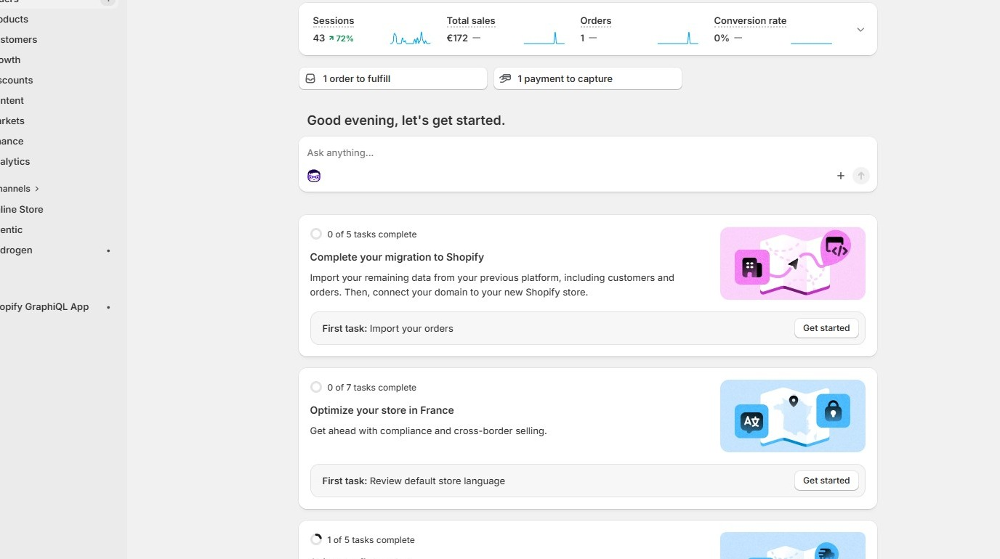
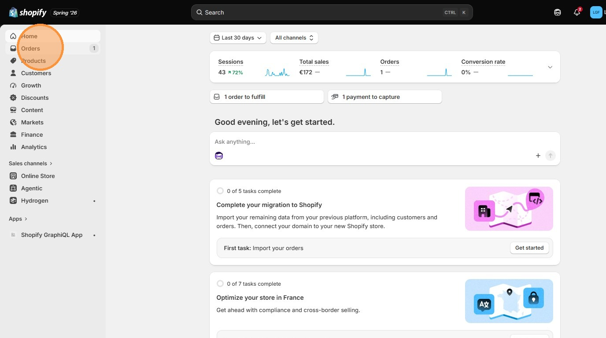
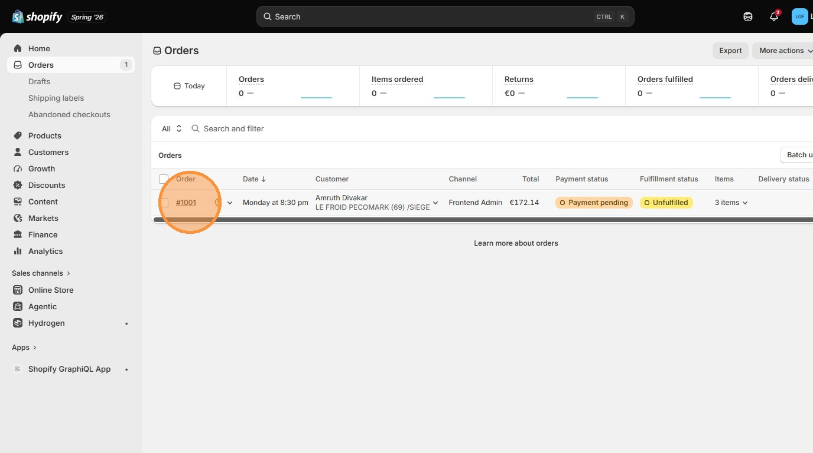
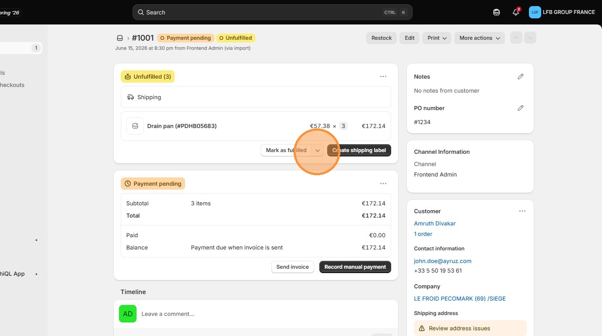
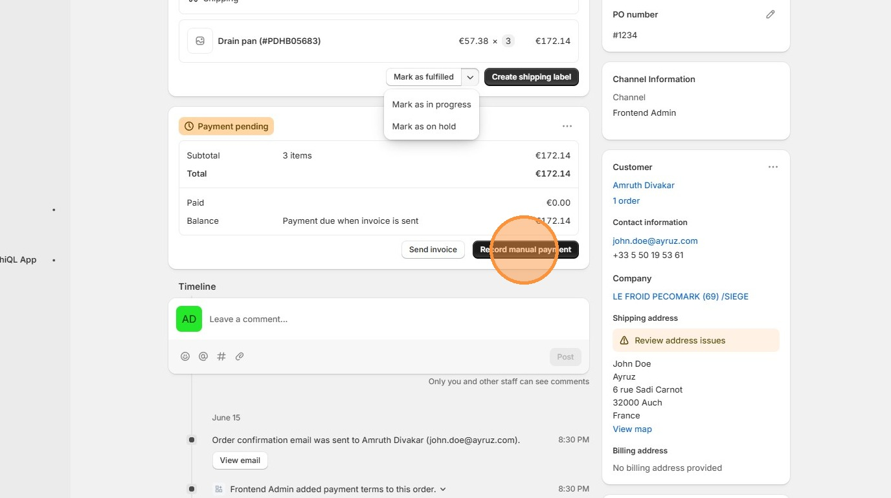

# View and Handle Orders
Learn how to efficiently navigate and manage specific orders within your Shopify admin dashboard. This guide simplifies the process of updating fulfillment status, payment information, and handling customer inquiries to ensure smooth business operations.

1\. Navigate to [Shopify Admin](https://admin.shopify.com/store/friga-bohn-spares-store)

2\. Click **Orders**

3\. Click on an order.

4\. Update fulfillment status here

5\. Update Payment status here

> ↑ [Go back to Shopify Admin](../shopify-admin.md)
