# Adding a Policy pages to the website
Learn how to easily link your store's privacy policy to your website's footer menu using the Shopify admin dashboard. This guide simplifies the process of configuring your footer navigation to ensure your legal pages are easily accessible to customers.

1\. Navigate to [Shopify Admin](https://admin.shopify.com/store/friga-bohn-spares-store)

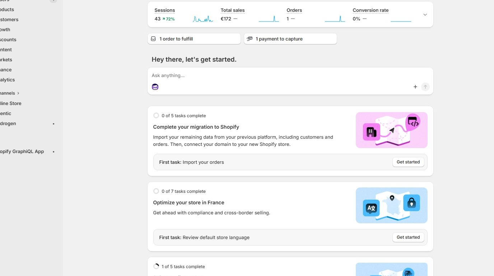

2\. Click **Settings**

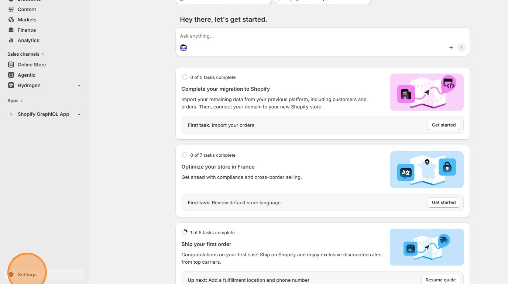

3\. Click **Policies**

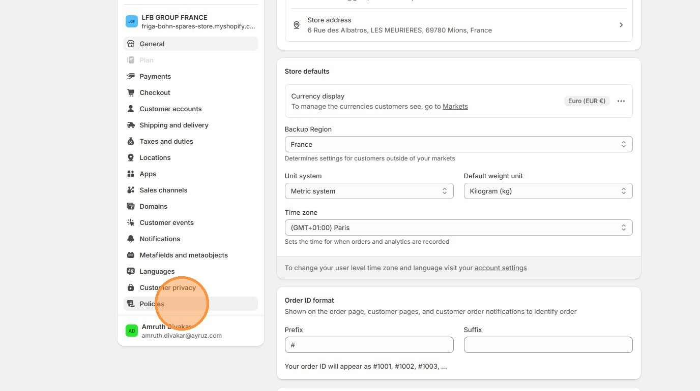

4\. Add/Edit any available policy

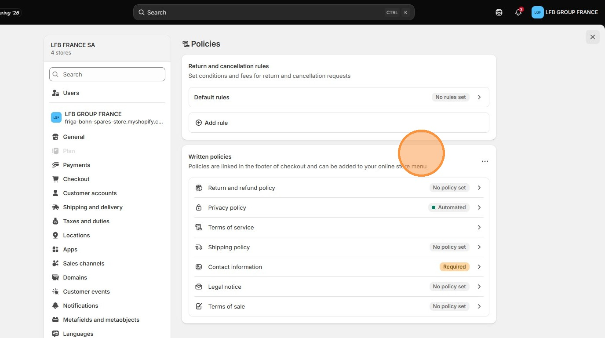

5\. Click this button to close **Settings**

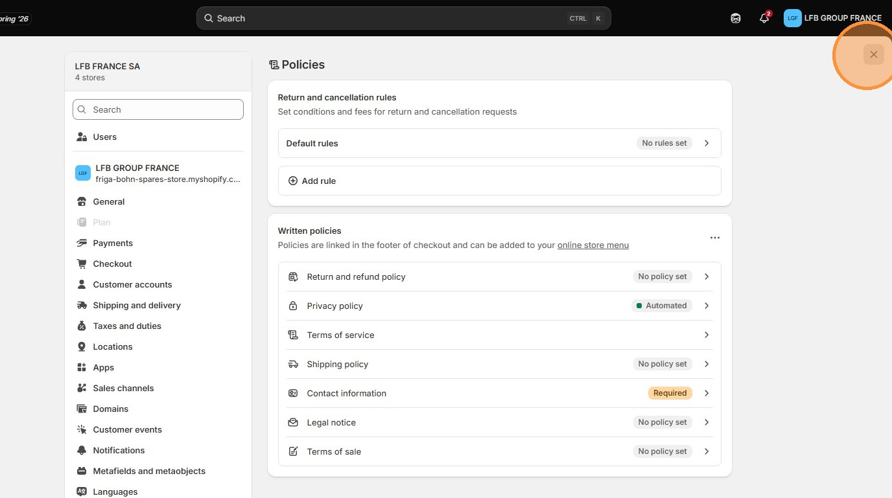

6\. Click **Content**

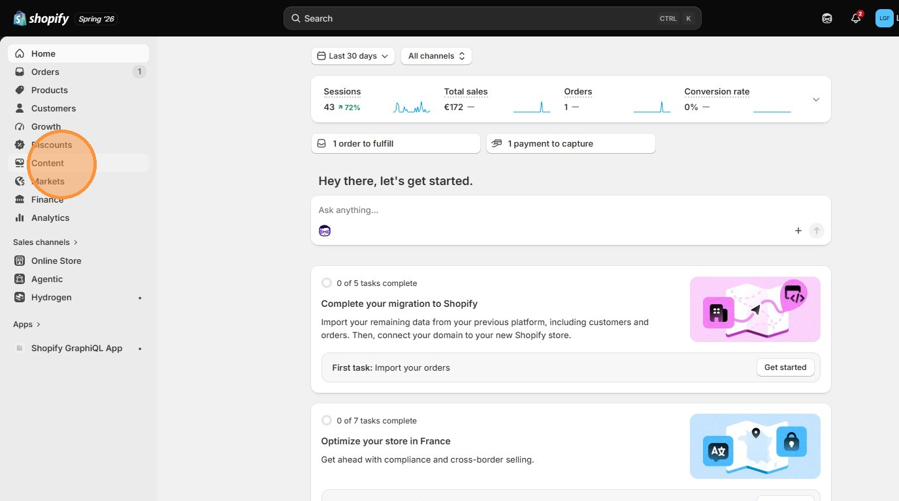

7\. Click **Menus**

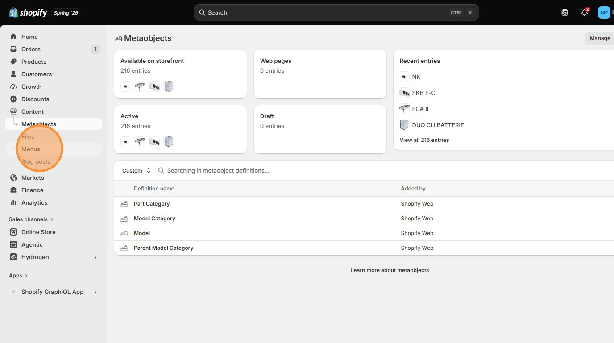

8\. Click **Footer menu**

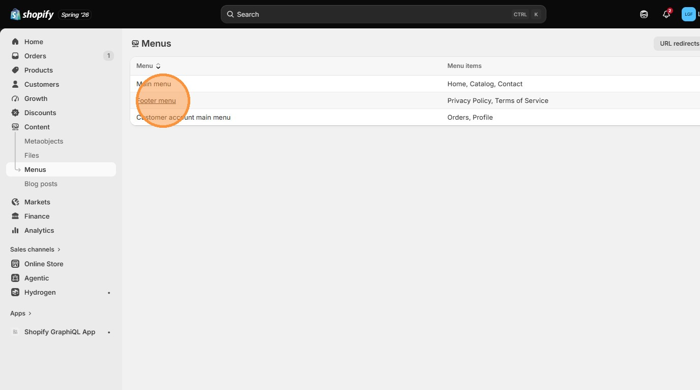

9\. Click **Add menu item**

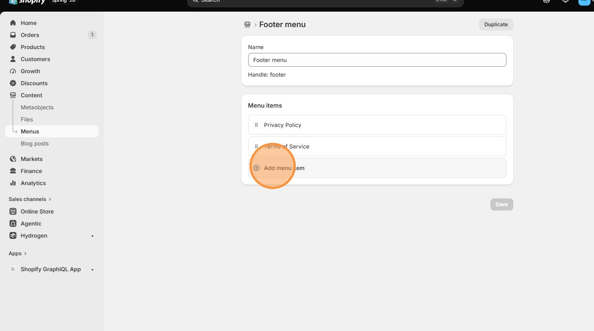

10\. Click the **Link** field.

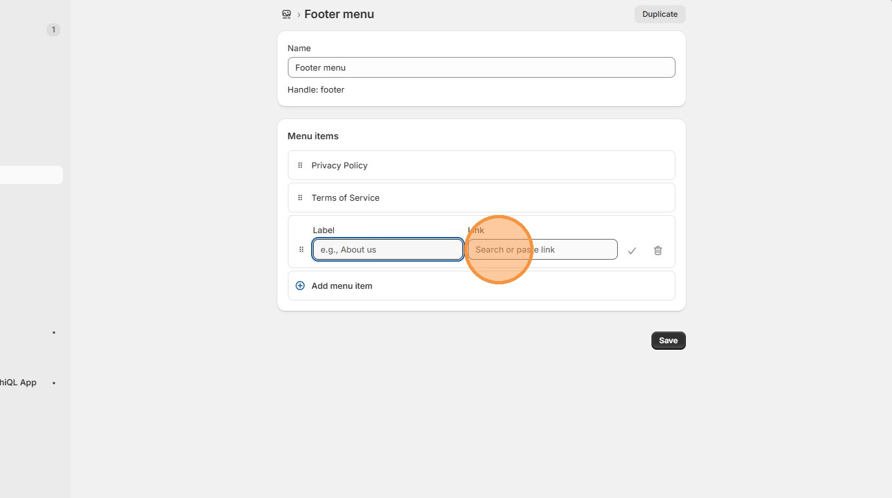

11\. Click **Policies** and add policies to the menu which will appear in the website Footer.

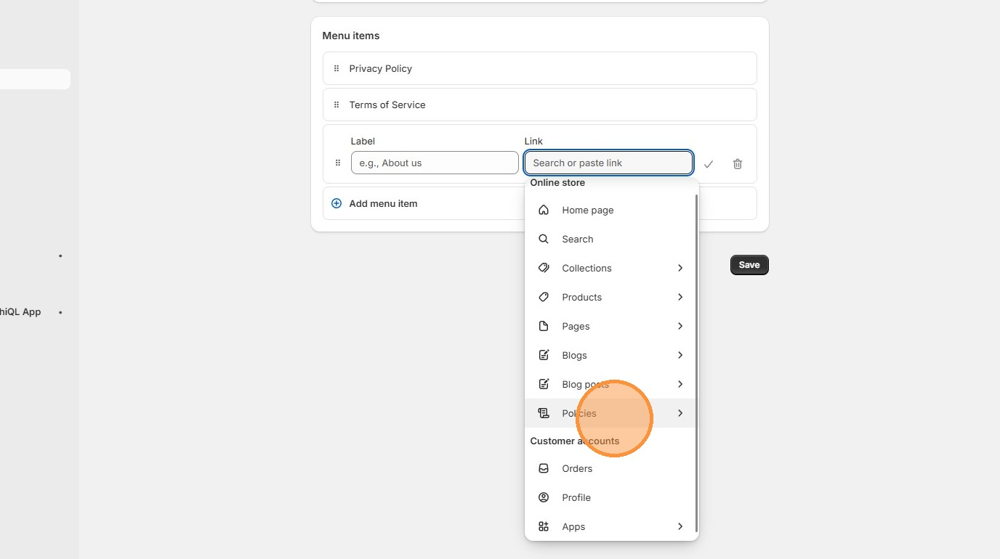

12\. To add Translations to the Policies, Click **Apps**

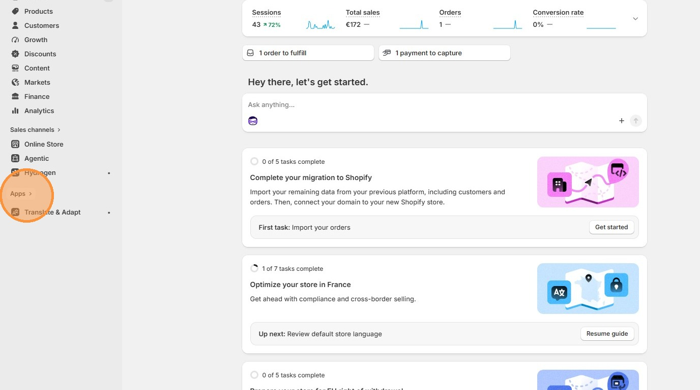

13\. Click **Translate & Adapt**

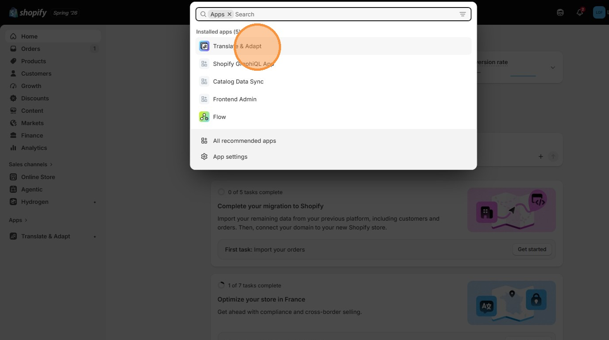

14\. Click **Policies**

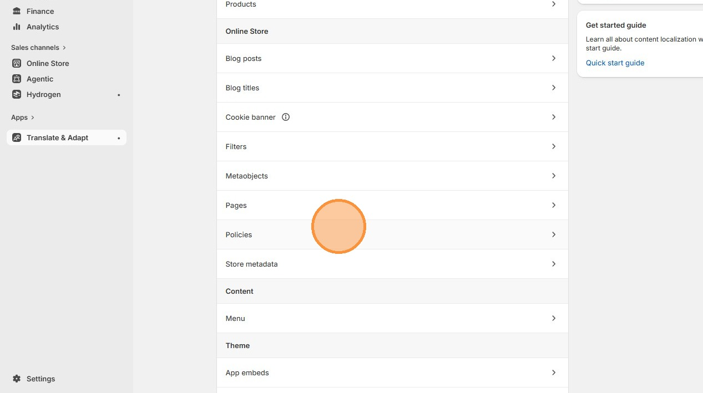

15\. Add translations to the added policies here

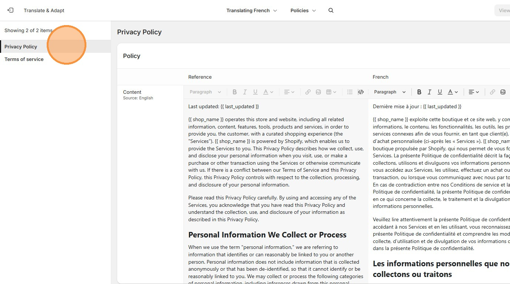

[Go back to Shopify Admin](../shopify-admin.md)
