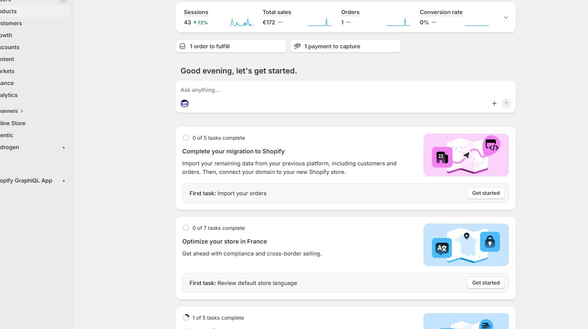
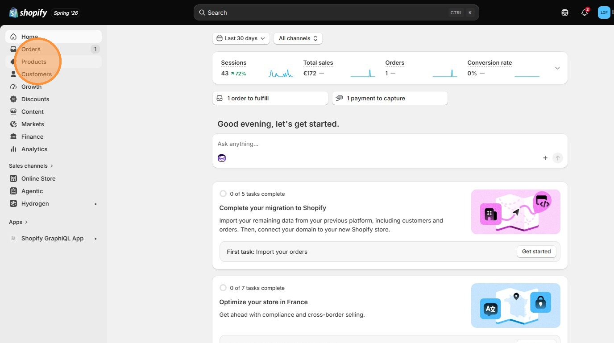
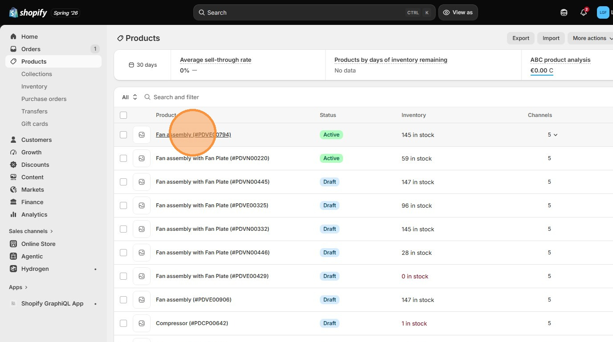
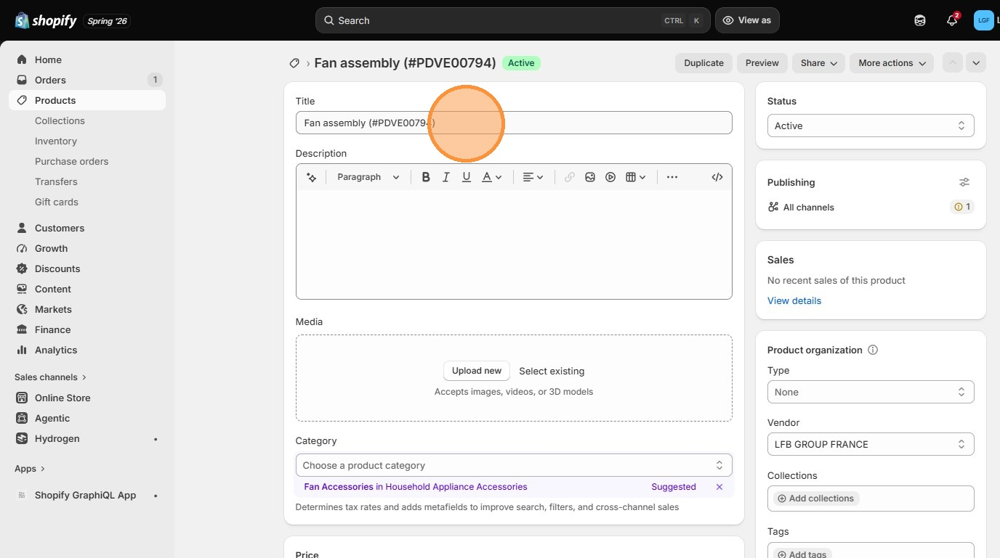
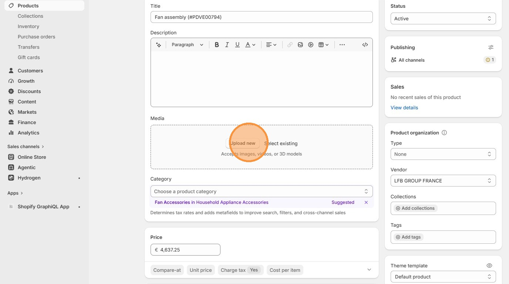
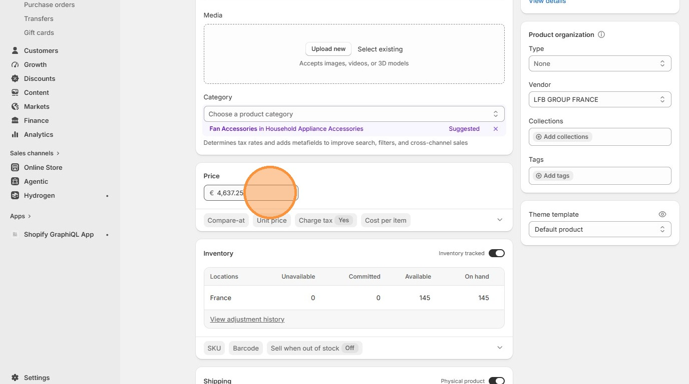
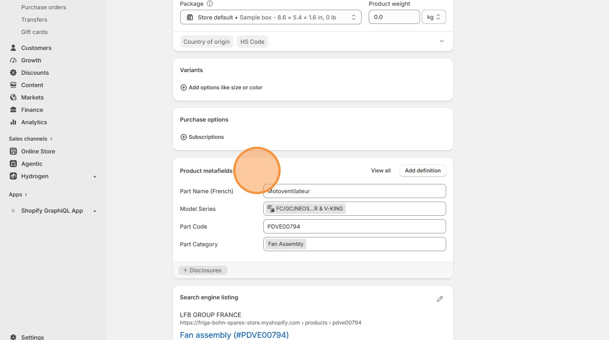
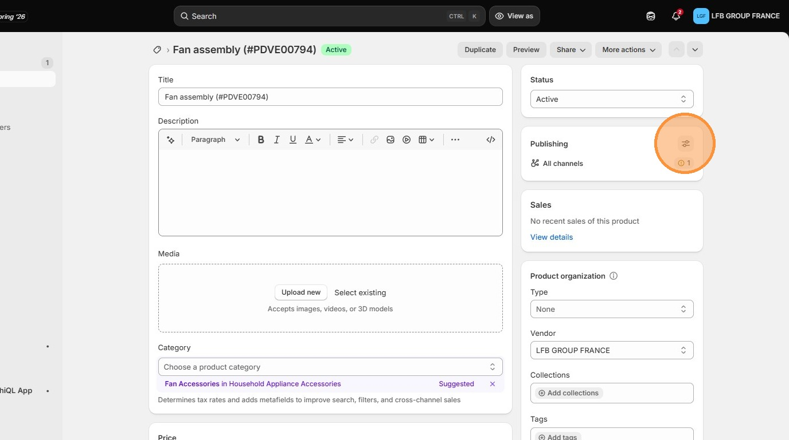
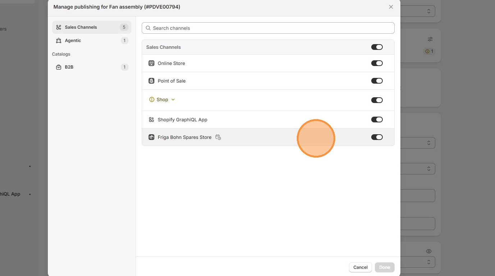

# How to Edit Product Details in Shopify Admin

Learn how to access and update specific product information and metafields within your Shopify store dashboard. This guide provides a straightforward walk-through for managing product listings and inventory details effectively.

1\. Navigate to [Shopify Admin](https://admin.shopify.com/store/friga-bohn-spares-store)

2\. Click **Products**

3\. Click on a product to view

4\. Edit **Title**

5\. Add or Update **Image**

6\. Edit **Price**

7\. Click other details in **Product metafield** section

8\. In **Publishing** , make sure the channels are setup

9\. Make sure the **Friga Bohn Spares Store** is enabled, so the part will be visible in the store website

[Go back to Shopify Admin](../shopify-admin.md)

