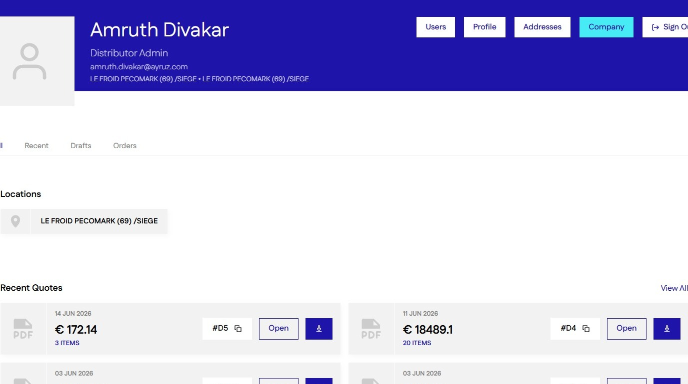
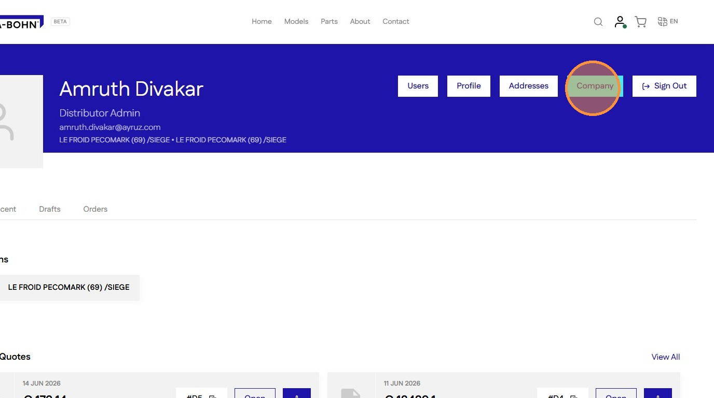
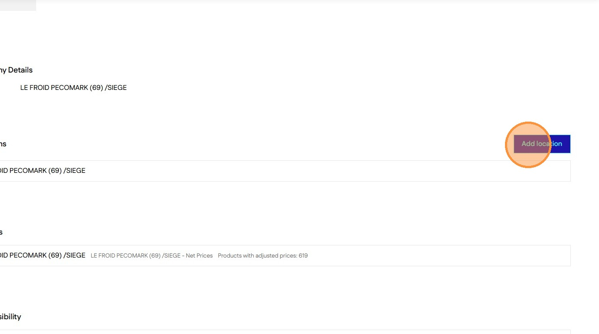
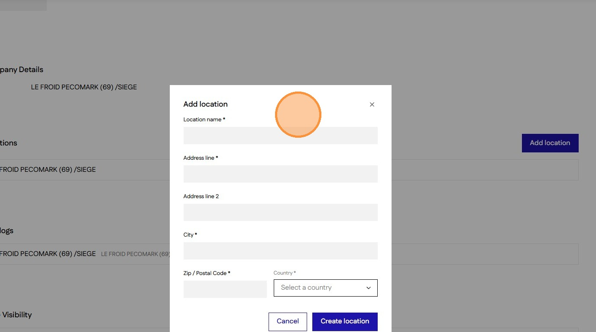
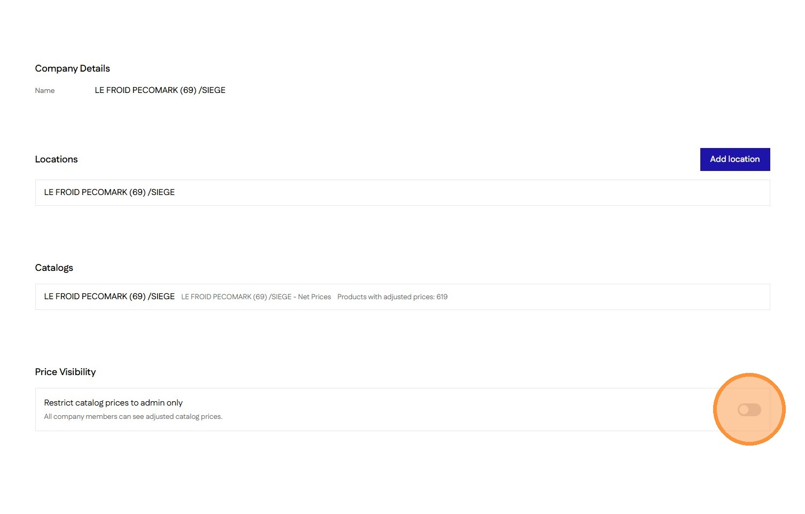

# How to Add a Company Location and set Price Visibility 
#### [Made by Amruth Divakar with Scribe](https://scribehow.com/o/AmjRagUGQxOh31NKNgqRAQ/viewer/How_to_Add_a_Company_Location_and_set_Price_Visibility__w73XW5giQCiJVgUctWJkvQ)
Learn how to manage your business operations by adding new locations to your company profile. This guide provides a simple walkthrough for inputting address details and configuring catalog price restrictions for your company users.(Company page access only available for Distributor Admins)

1\. Navigate to [[Accounts]] Page

2\. Click "Company"

3\. Click "Add location"

4\. Fill the form and click [[Create location]] to add a new location

5\. Set Price Visibility to [[On]], to hide the catalog prices from Distributor and Distributor Location Admin roles

#### [Made with Scribe](https://scribehow.com/o/AmjRagUGQxOh31NKNgqRAQ/viewer/How_to_Add_a_Company_Location_and_set_Price_Visibility__w73XW5giQCiJVgUctWJkvQ)

