# How to Manage User in the Website
#### [Made by Amruth Divakar with Scribe](https://scribehow.com/o/AmjRagUGQxOh31NKNgqRAQ/viewer/How_to_Manage_User_in_the_Website__ti6LMcV2QQmY_ykFEp4BMg)
Follow this guide to learn the necessary steps for adding/update users to your Shopify account. You will find instructions on assigning specific roles and locations to ensure your team has the correct system access.

1\. Navigate to [[Account]] Page

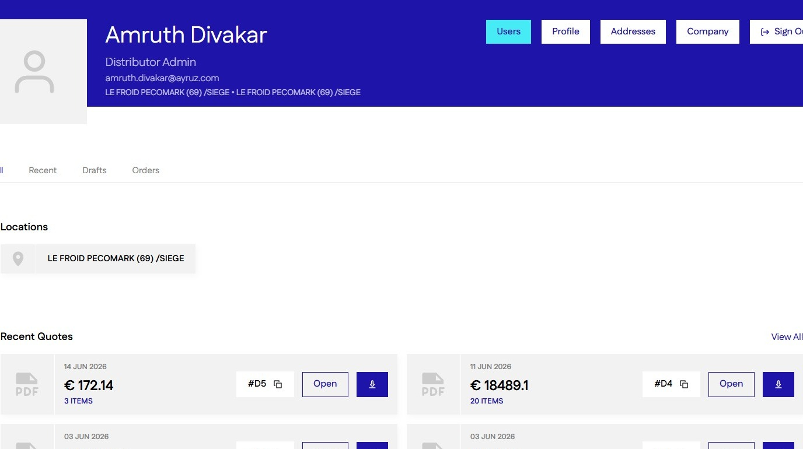

2\. Click "Users"

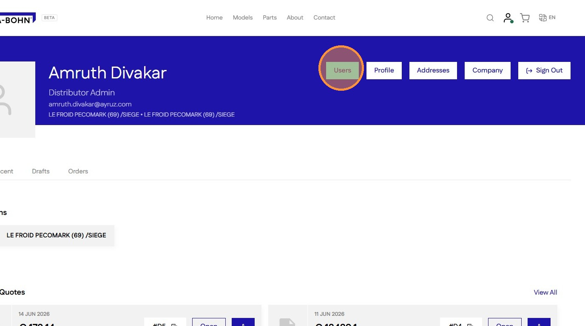

3\. Click "Add User" to add a new User

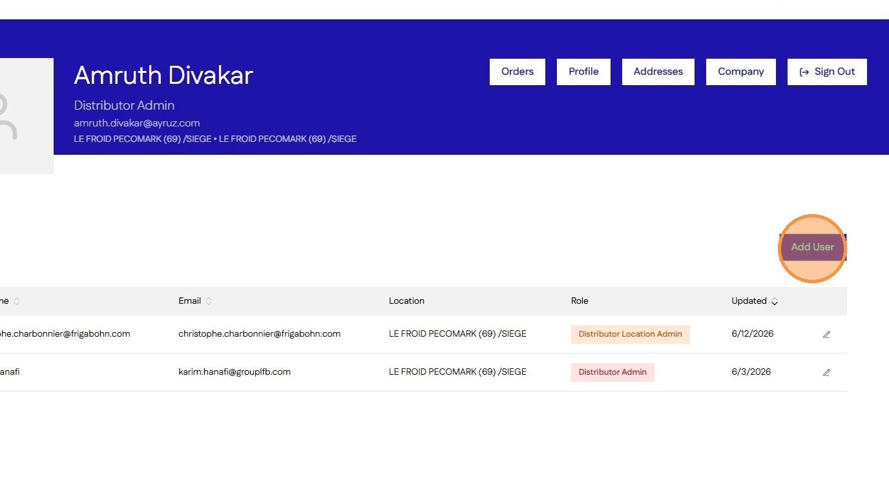

4\. Add User details

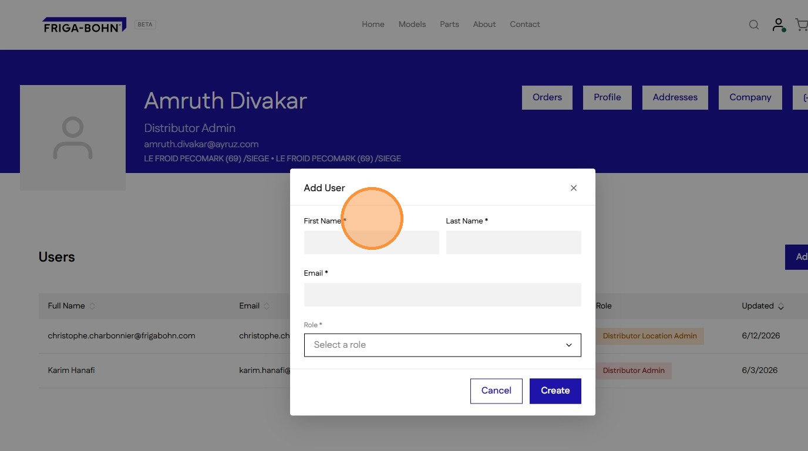

5\. Click "Select a role"

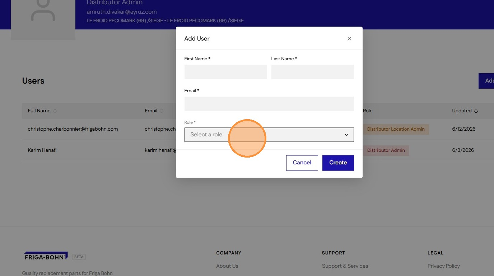

6\. Select a role

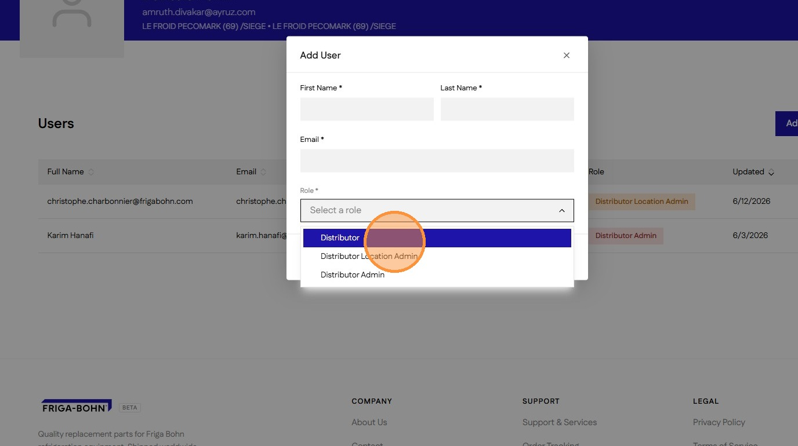

7\. Select a Company (access only available for Accounts and Web Admins, defaults to own company for Distributor Admin )

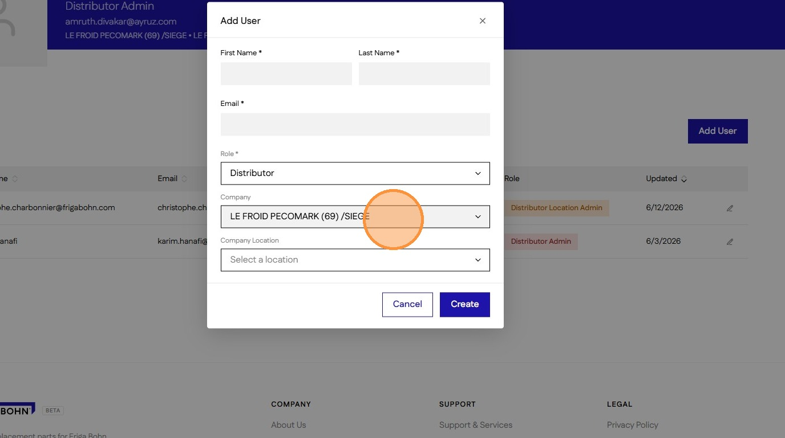

8\. Click "Select a location"

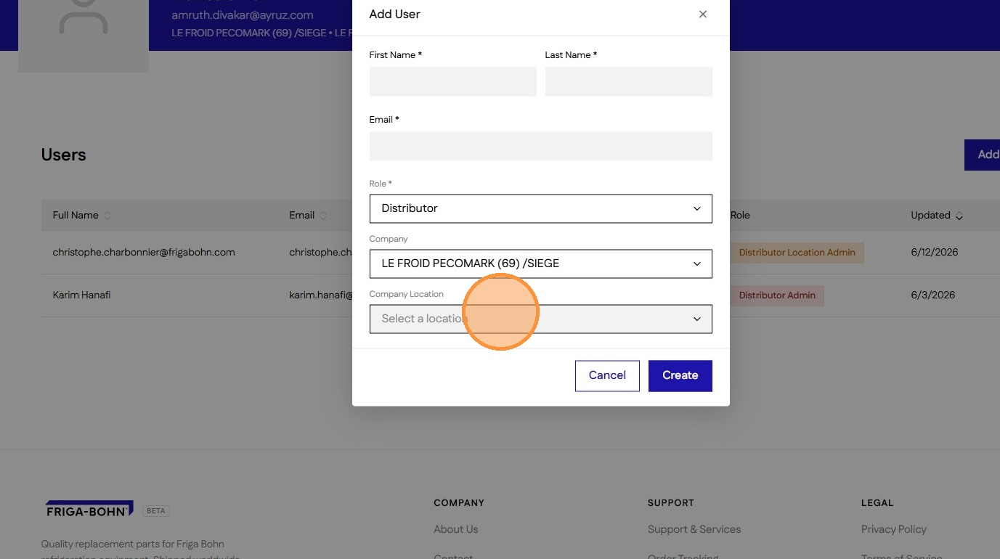

9\. Select a company location for the user.

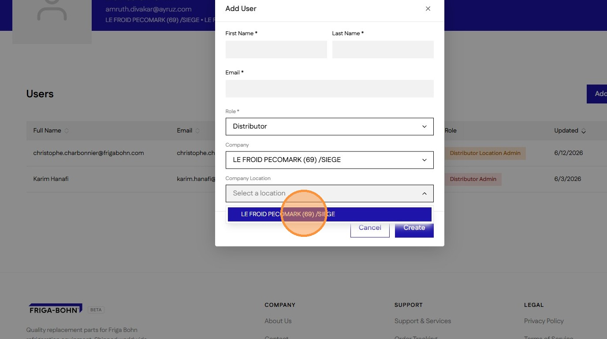

10\. Click "Create"

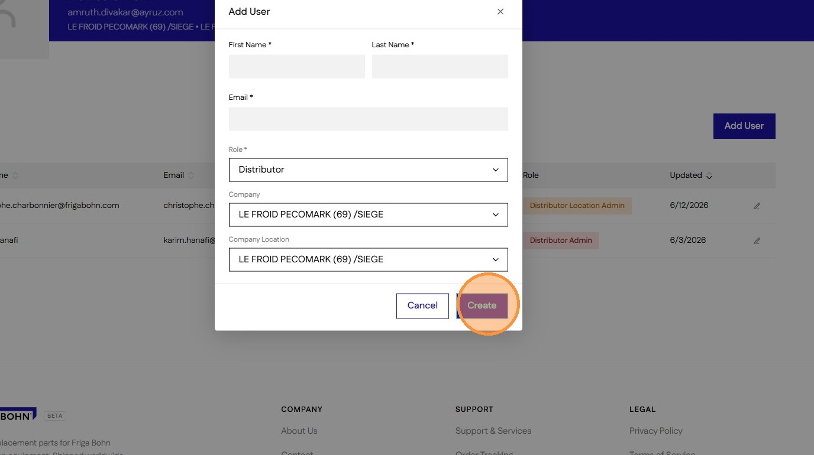

11\. Click this icon to edit a User.

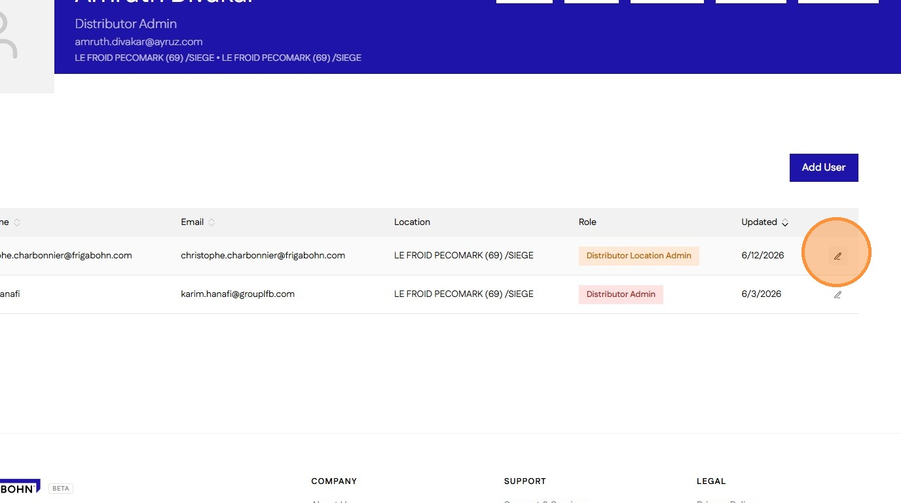
#### [Made with Scribe](https://scribehow.com/o/AmjRagUGQxOh31NKNgqRAQ/viewer/How_to_Manage_User_in_the_Website__ti6LMcV2QQmY_ykFEp4BMg)

