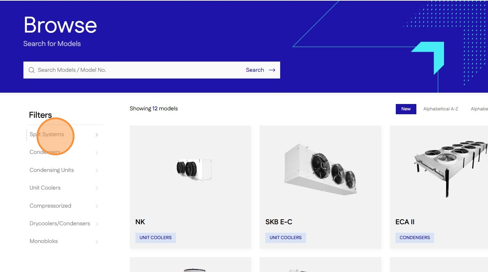
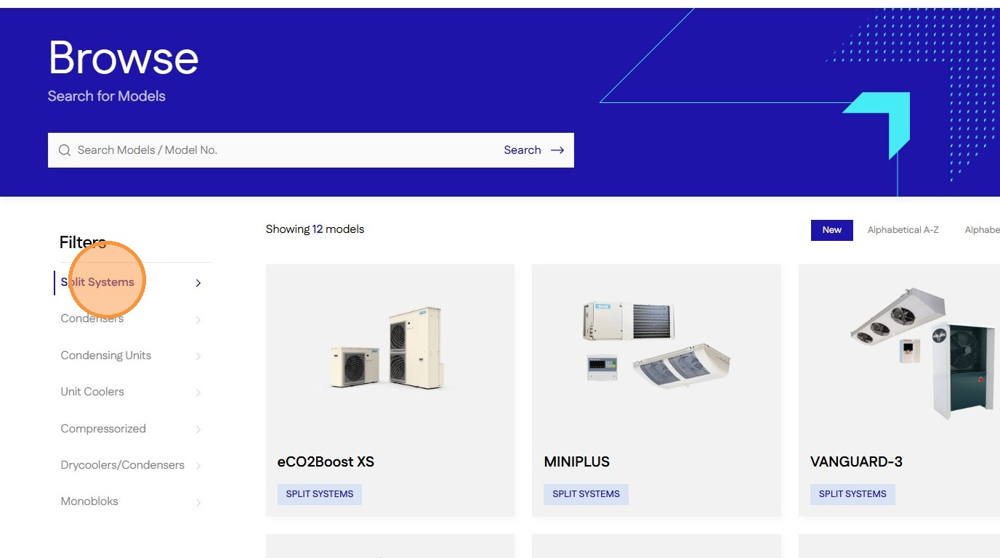

# Navigating Product Categories on the Shopify Store
#### [Made by Amruth Divakar with Scribe](https://scribehow.com/o/AmjRagUGQxOh31NKNgqRAQ/viewer/Navigating_Product_Categories_on_the_Shopify_Store__gpWPTcmvS3axf_WXD3_9VA)
Learn how to efficiently browse through specific product categories to find the equipment you need. This guide provides a simple walkthrough of the navigation steps required to reach the condensing units section.

1\. Navigate to [**Models**](https://staging-28eafe2bb41e547cf237.o2.myshopify.dev/browse) page

2\. Click on a [[category]] in Filter sidebar

3\. Click on the selected [[category]] to reset filter

#### [Made with Scribe](https://scribehow.com/o/AmjRagUGQxOh31NKNgqRAQ/viewer/Navigating_Product_Categories_on_the_Shopify_Store__gpWPTcmvS3axf_WXD3_9VA)

