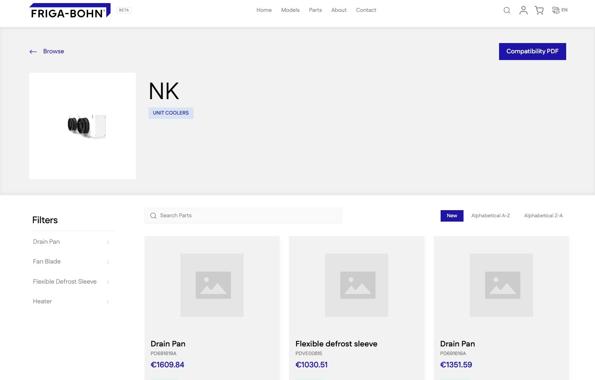
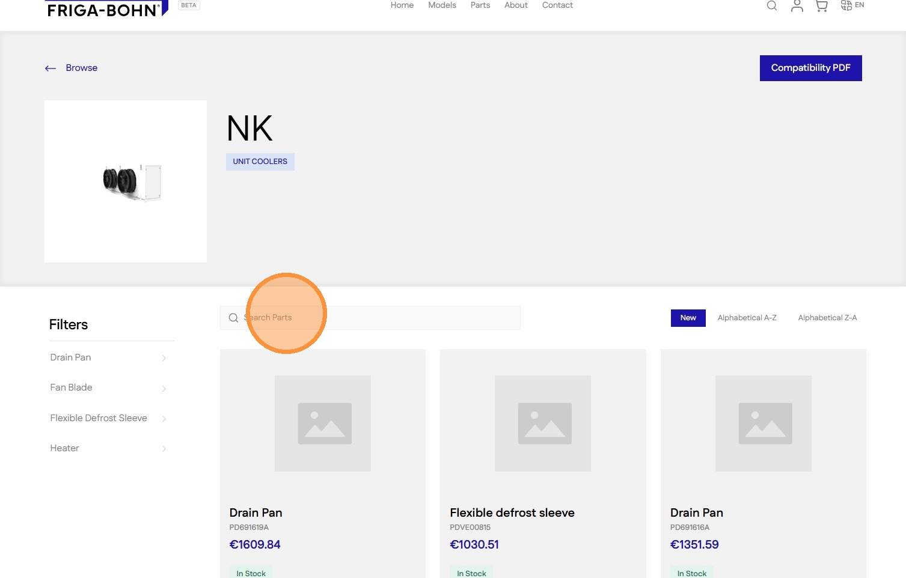
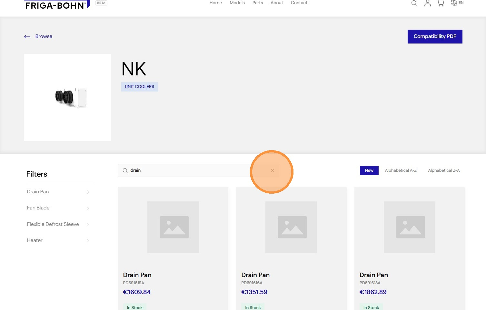
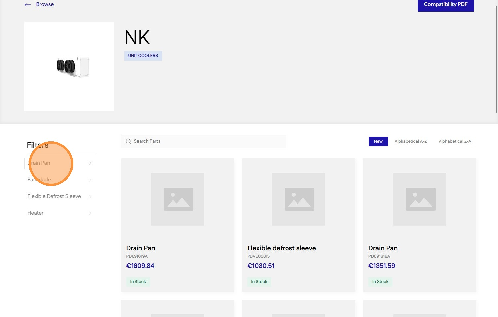
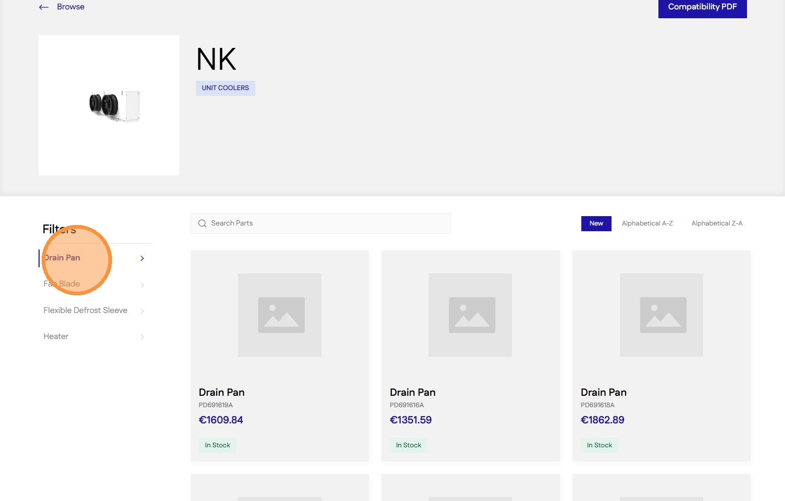
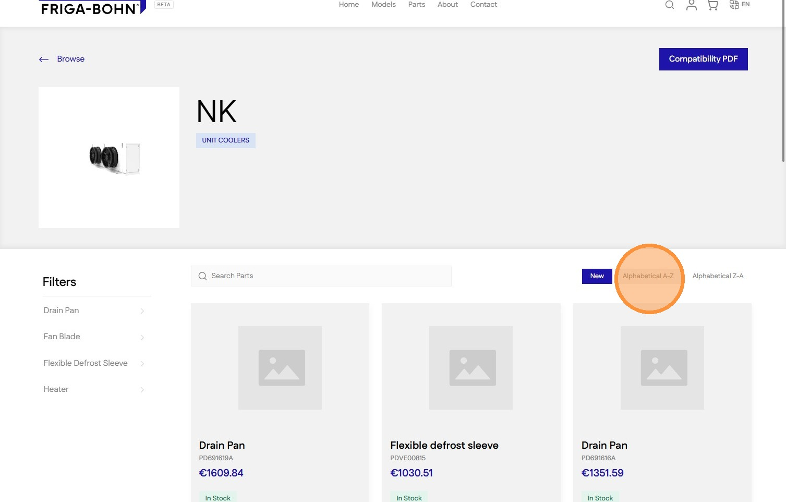
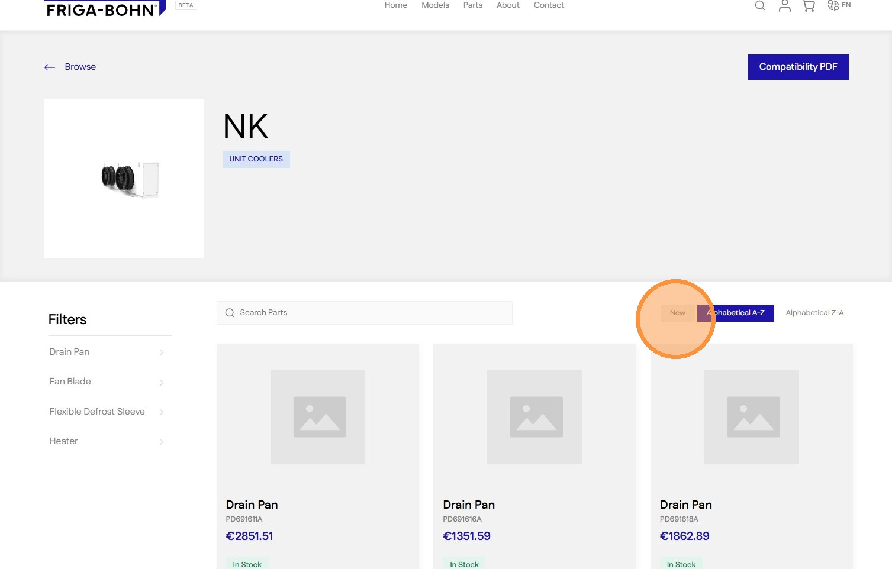
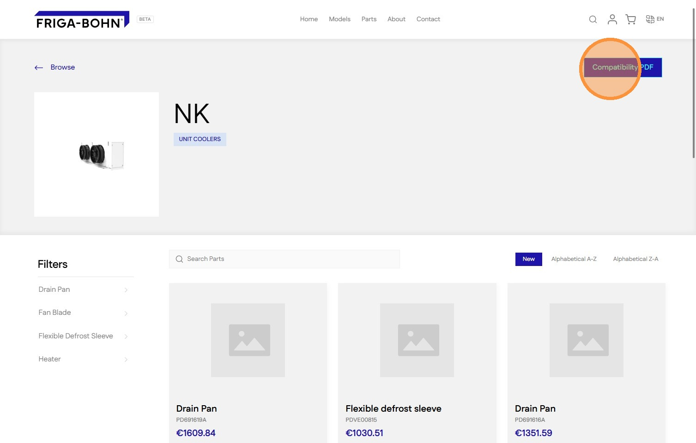

# How to Search and View Product Parts For a Modal Documentation
#### [Made by Amruth Divakar with Scribe](https://scribehow.com/o/AmjRagUGQxOh31NKNgqRAQ/viewer/How_to_Search_and_View_Product_Parts_For_a_Modal_Documentation__ii40V0vqSZyM5lxRnqejiw)
Learn how to efficiently locate specific components using the search functionality on the parts portal. This guide also demonstrates how to filter your results and access detailed compatibility documentation in PDF format.

1\. Navigate to [models/nk](https://staging-28eafe2bb41e547cf237.o2.myshopify.dev/models/nk) or any model page

2\. Click the [[Search Box]] to search

3\. Enter the search term followed by  [[Enter]] to submit

4\. Click the [[Clear (X)]] icon to clear and reset search results

5\. Click on any [[Category]] in the [[Filter]] sidebar to filter

6\. Click on the active Filter category to reset filter

7\. Click on the [[Sort]] options to sort the results

8\. Click on [[New]] to reset the sorting to default

9\. Click [[Compatibility PDF]] button to view the compatibility document for this model

#### [Made with Scribe](https://scribehow.com/o/AmjRagUGQxOh31NKNgqRAQ/viewer/How_to_Search_and_View_Product_Parts_For_a_Modal_Documentation__ii40V0vqSZyM5lxRnqejiw)

