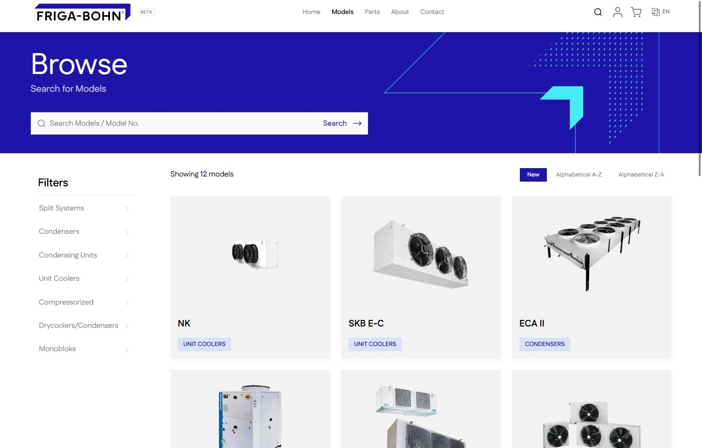
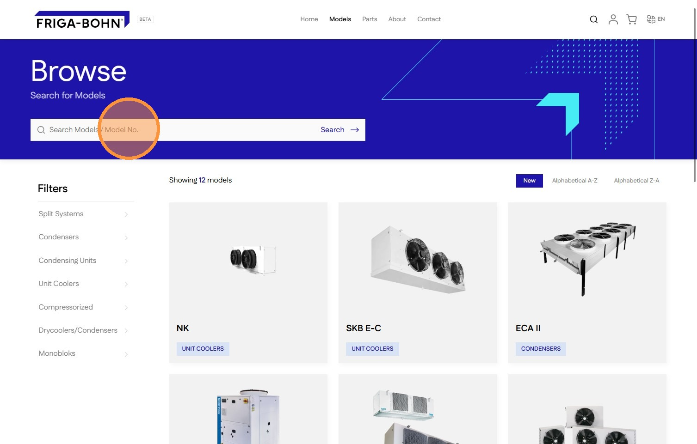
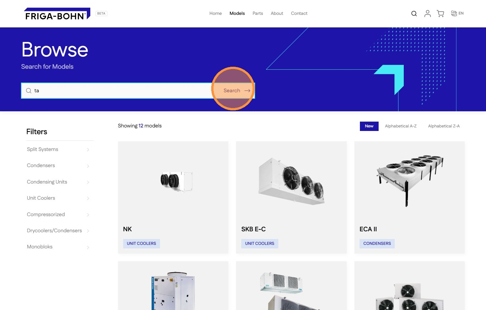
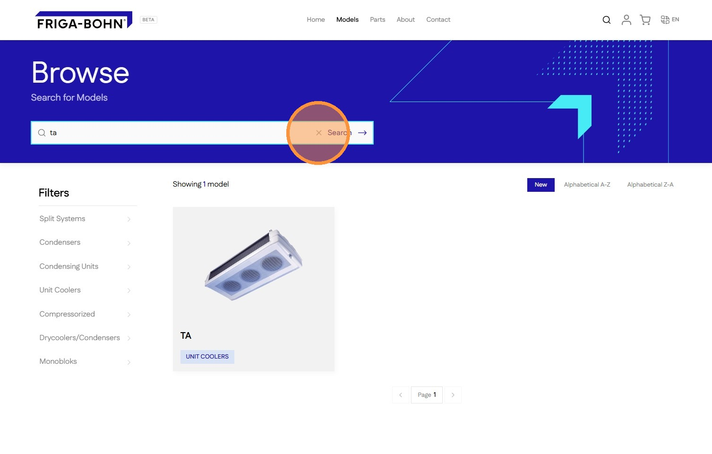

# How To Search For Models On Your Storefront
#### [Made by Amruth Divakar with Scribe](https://scribehow.com/o/AmjRagUGQxOh31NKNgqRAQ/viewer/How_To_Search_For_Models_On_Your_Storefront__nle4v2HSTBq6tAqXBg09sw)
Learn how to efficiently locate specific products or model numbers using the storefront search feature. This guide will walk you through the navigation steps to quickly filter results and find the exact items you need.

1\. Navigate to [Models](https://staging-28eafe2bb41e547cf237.o2.myshopify.dev/browse) page

2\. Click the **[[Search box]]** field.

3\. Enter the search term

4\. Click [[Enter]] or click the [[Search button]]

5\. This shows the search result. Click the [[X]] / [[Clear]] button to reset search

#### [Made with Scribe](https://scribehow.com/o/AmjRagUGQxOh31NKNgqRAQ/viewer/How_To_Search_For_Models_On_Your_Storefront__nle4v2HSTBq6tAqXBg09sw)

