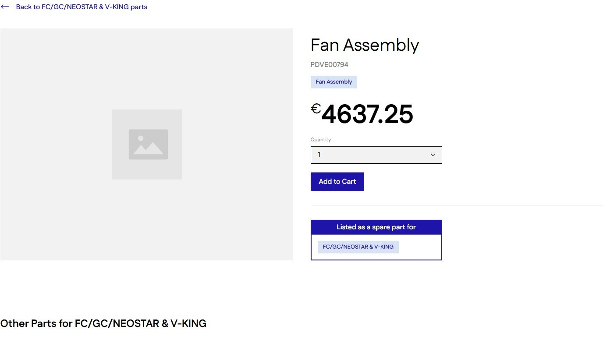
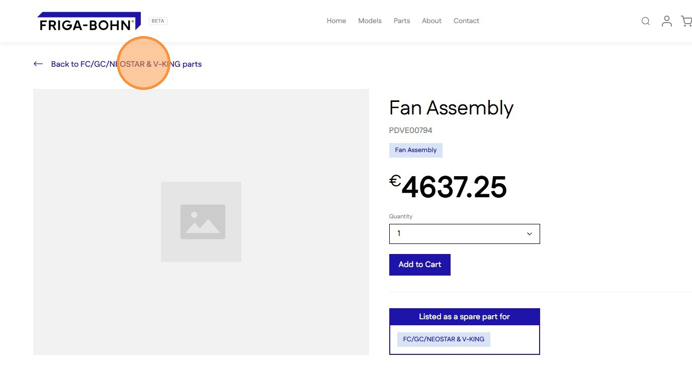
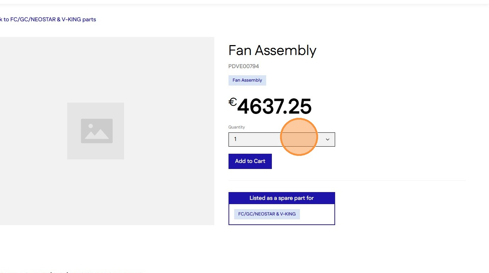
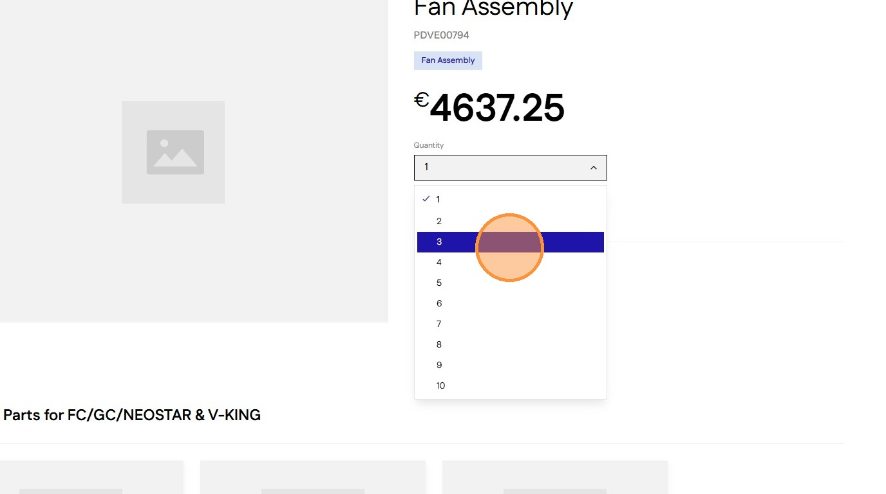
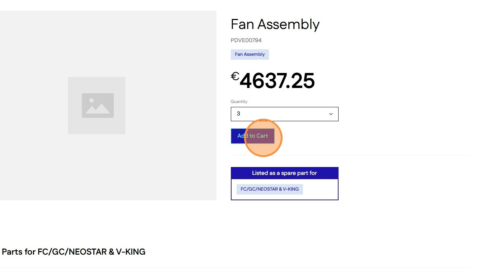
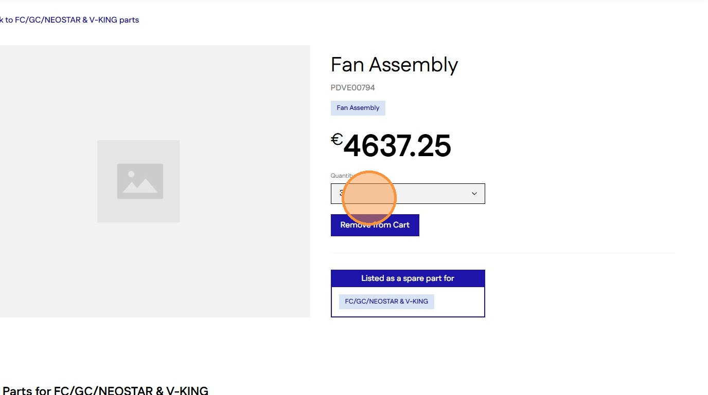
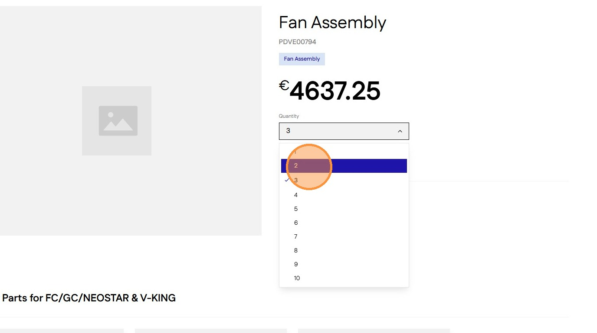
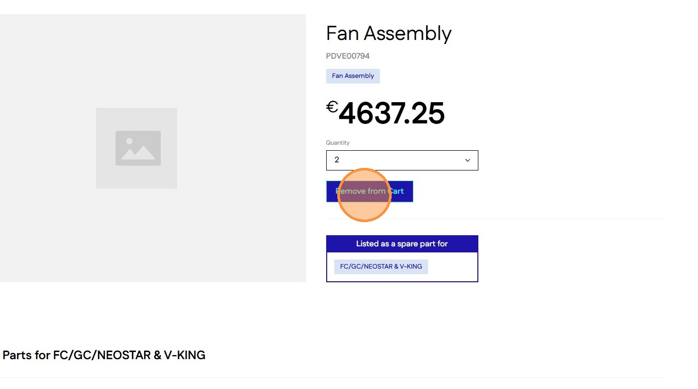
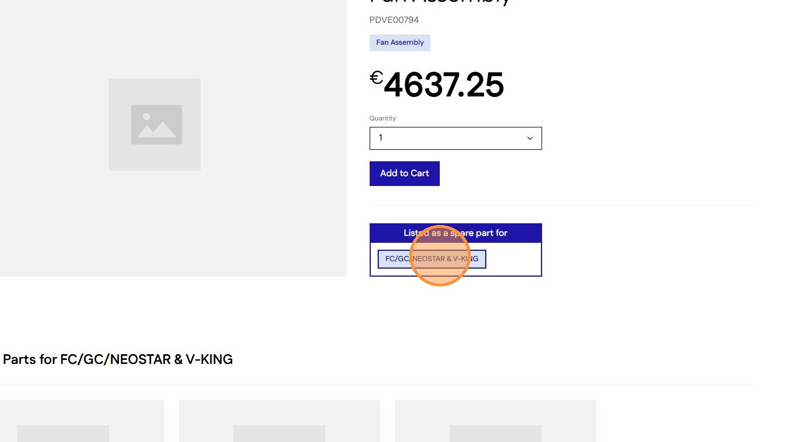
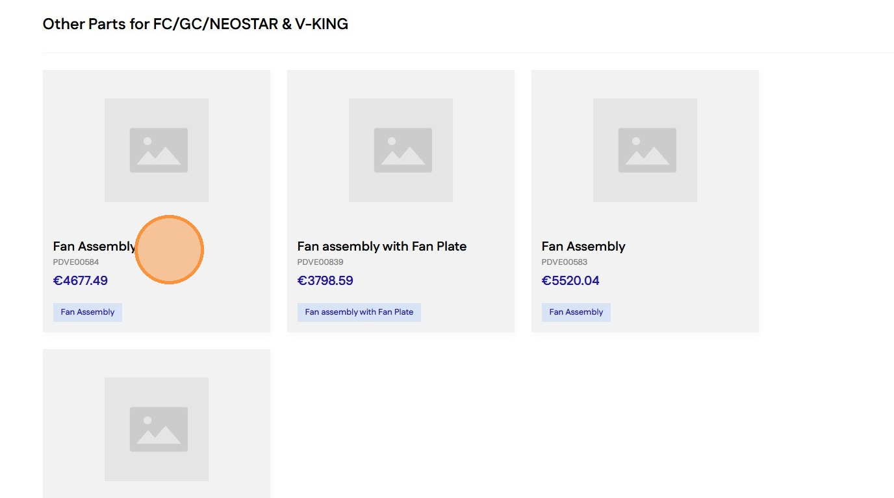

# Managing Parts and Cart Selections on Part page
#### [Made by Amruth Divakar with Scribe](https://scribehow.com/o/AmjRagUGQxOh31NKNgqRAQ/viewer/Managing_Parts_and_Cart_Selections_on_Part_page__uxuX3GaYSS6_wyRQlXJIYQ)
Learn how to efficiently browse product categories and manage items in your shopping cart. This guide demonstrates how to add specific parts, adjust quantities, and navigate between product pages seamlessly.

1\. Navigate to a [Part ](https://staging-28eafe2bb41e547cf237.o2.myshopify.dev/parts/pdve00794)page

2\. Click [[Back to <Modal name> parts]] to see the full list of parts for this modal

3\. Select the [[Quantity]] Dropdown to change quantity

4\. Select from the list of numbers

5\. Click [[Add to Cart]] to add item to cart

6\. Change the added quantity of the item using the [[Quantity]] dropdown

7\. Select the quantity to update cart

8\. Click [[Remove from Cart]] to remove item from cart

9\. Click [[Model Tag]] to view the Compatibility Document of the modal

10\. [[Other Parts]] section shows parts that are also compatible with this modal

#### [Made with Scribe](https://scribehow.com/o/AmjRagUGQxOh31NKNgqRAQ/viewer/Managing_Parts_and_Cart_Selections_on_Part_page__uxuX3GaYSS6_wyRQlXJIYQ)

