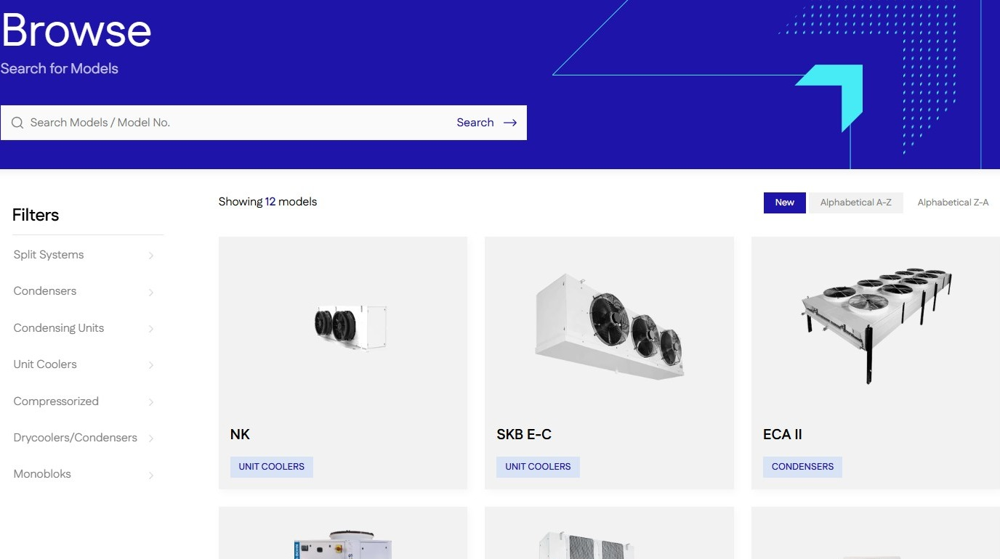
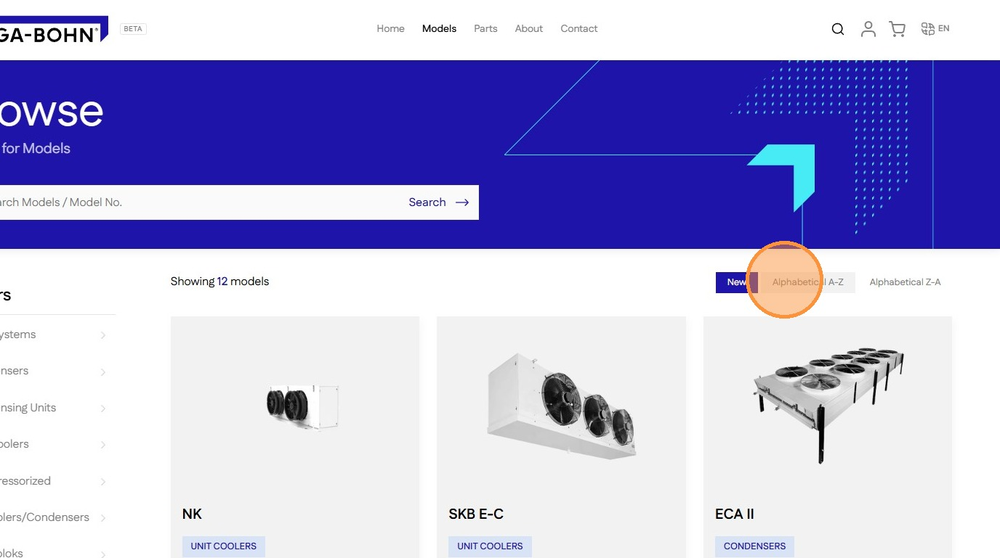

# How To Sort Products On The Shop Page
#### [Made by Amruth Divakar with Scribe](https://scribehow.com/o/AmjRagUGQxOh31NKNgqRAQ/viewer/How_To_Sort_Products_On_The_Shop_Page__FzZJ_jbGQrC3hYXffqv9TA)
Learn how to efficiently organize your product listings by adjusting sort preferences. This guide helps you navigate between alphabetical and chronological views to find exactly what you are looking for quickly.

1\. Navigate to [Models](https://staging-28eafe2bb41e547cf237.o2.myshopify.dev/browse?page=1&sort=new) page

2\. Click "Alphabetical A-Z" to sort A-Z

3\. Click "Alphabetical Z-A" to sort Z-A

4\. Click "New" to return to default view

#### [Made with Scribe](https://scribehow.com/o/AmjRagUGQxOh31NKNgqRAQ/viewer/How_To_Sort_Products_On_The_Shop_Page__FzZJ_jbGQrC3hYXffqv9TA)

