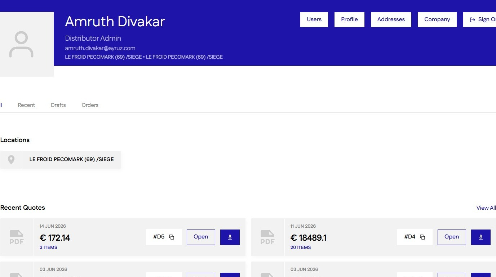
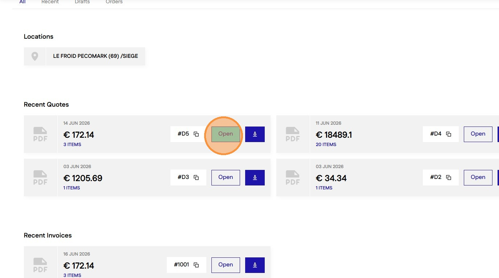
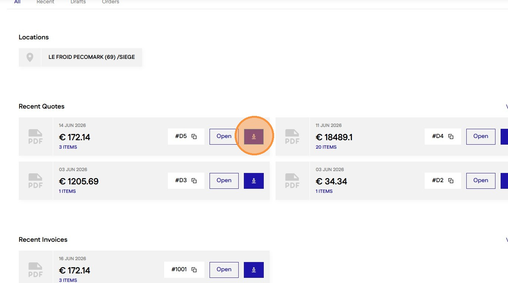
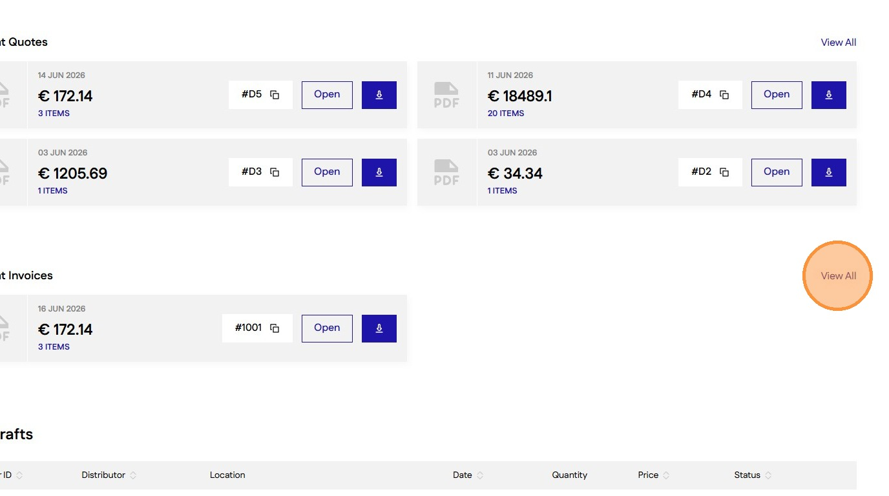
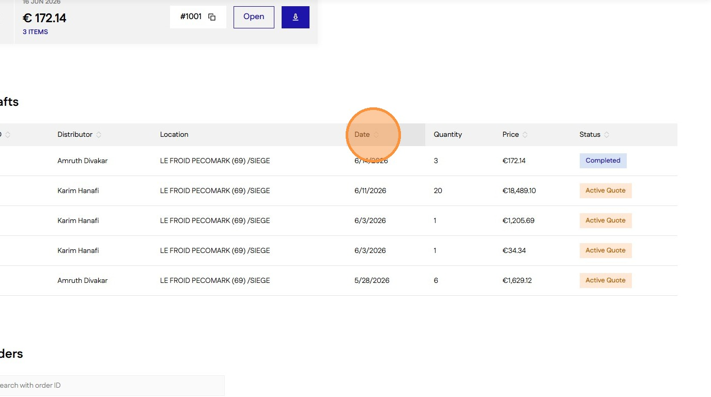
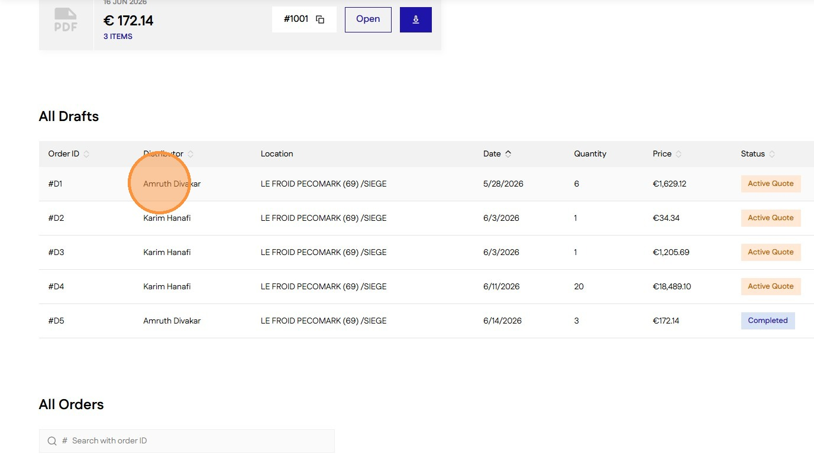

# How to View and Access Customer Order Invoices

Learn how to navigate your Shopify account to locate specific order details and download associated invoices. This guide streamlines the process of finding historical billing information for your clients.

1\. Navigate to **account/orders** page

2\. Use the tabs to view sections individually

3\. View Draft and Order table for each location by clicking a Location card (Distributor Admin only)

4\. Click the copy button on a Document card to copy the draft or order number

5\. Click **Open** to view the Quote or Invoice

6\. Click the Download button to Download the quote or Invoice

7\. Click **View All** to view the full list of Quotes or Invoices

8\. Sortable table columns have a Sort icon. Click the column header to cycle through the sort options

9\. Click on a table row to go to the Draft or Order page

[Go back to Accounts](../account.md)