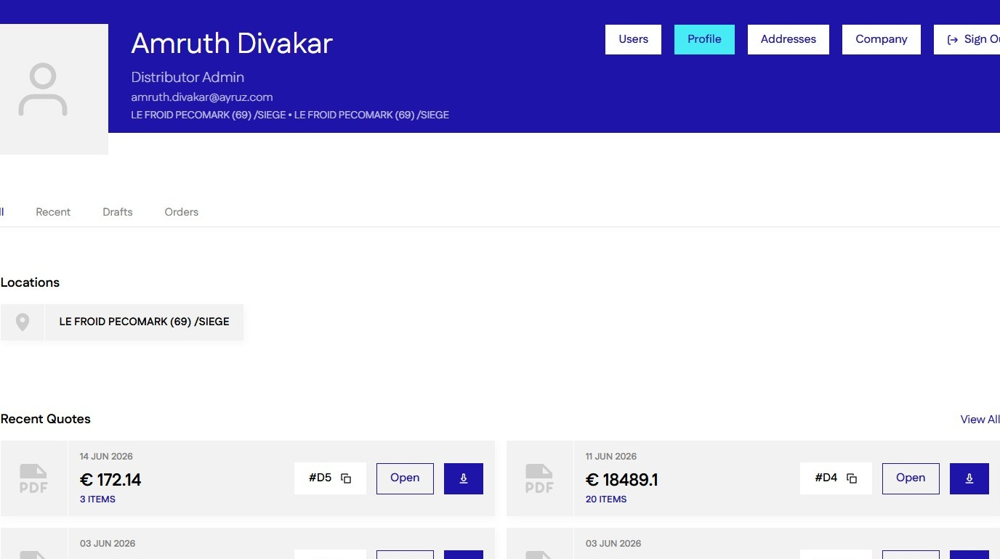
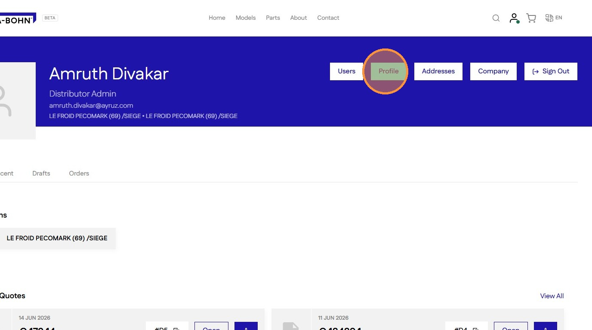
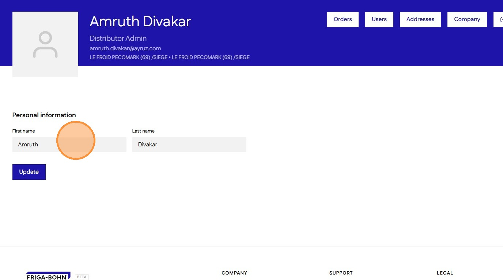
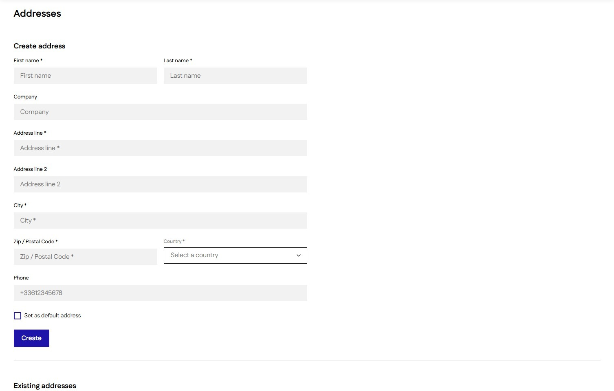

# Managing Customer Account Details and Addresses

Learn how to efficiently navigate your account settings to update personal profile information and manage shipping addresses. This guide simplifies the process of editing your data and organizing your saved address book for a smoother checkout experience.

1\. Navigate to **Account** Page

2\. Click **Profile**

3\. Update personal information here

4\. Click **Addresses**

5\. Create a new **Address**

6\. Update/Delete/Set Default **Existing Addresses**

[Go back to Accounts](../account.md)