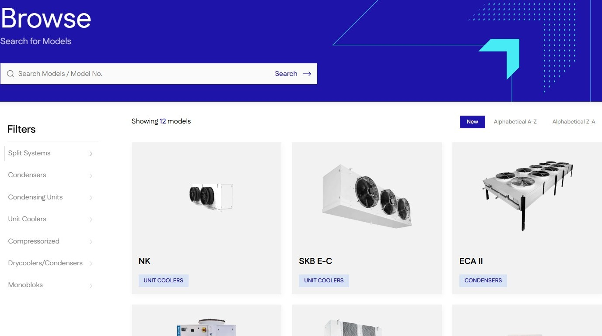

# Navigating Product Categories on the Shopify Store

Learn how to efficiently browse through specific product categories to find the equipment you need. This guide provides a simple walkthrough of the navigation steps required to reach the condensing units section.

1\. Navigate to **Models** page

2\. Click on a **category** in Filter sidebar

3\. Click on the selected **category** to reset filter

> ↑ [Go back to Catalogue](../catalogue.md)