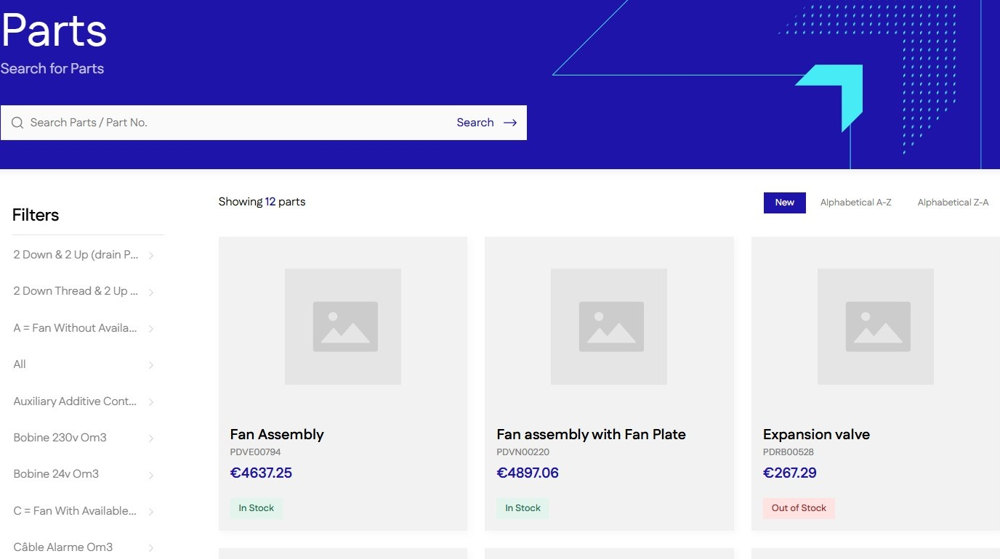
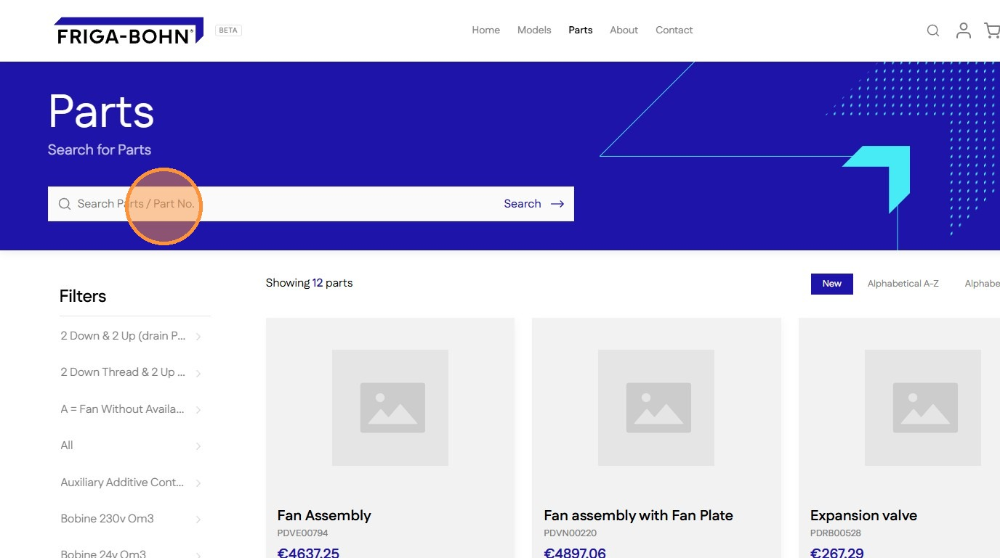
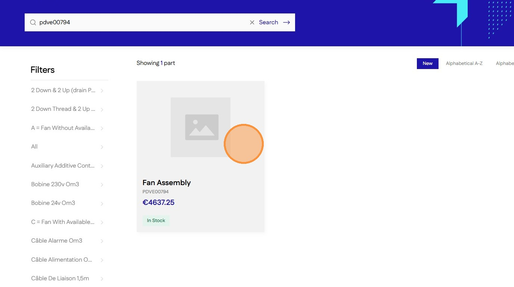

# How To Search For Parts Using Part Numbers

Learn how to efficiently locate specific components on your Shopify store using the dedicated search field. This guide walks you through the quick process of entering a part number to find exactly what you need in seconds.

1\. Navigate to **Parts** page

2\. Click the **Search Box** field.

3\. Type Part number like, "pdve00794" followed by  **Enter** or clicking the **Search** button

4\. Search will return the part with the entered part number

[Go back to Catalogue](../catalogue.md)