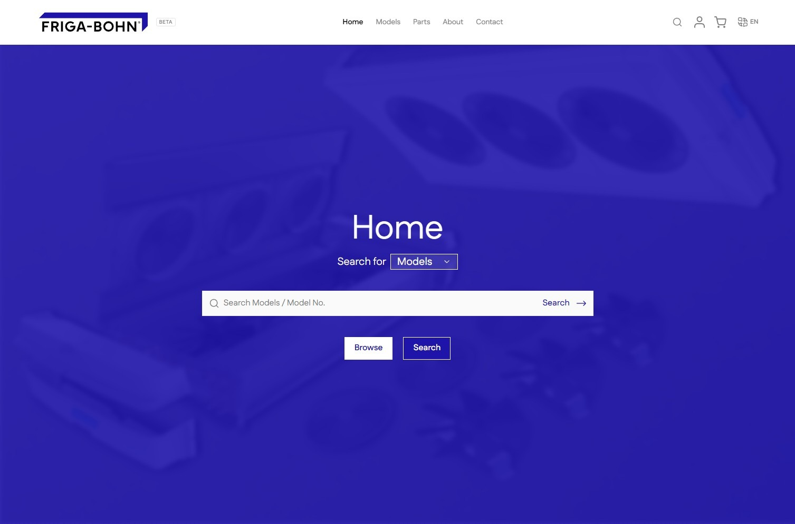
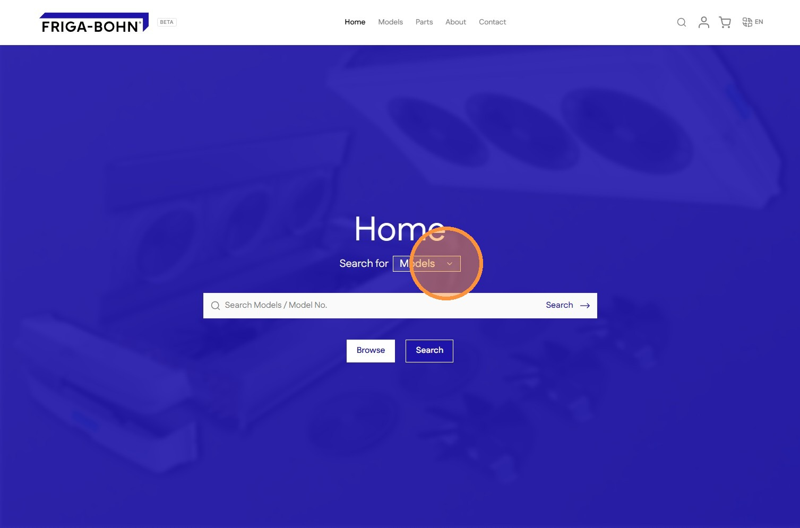
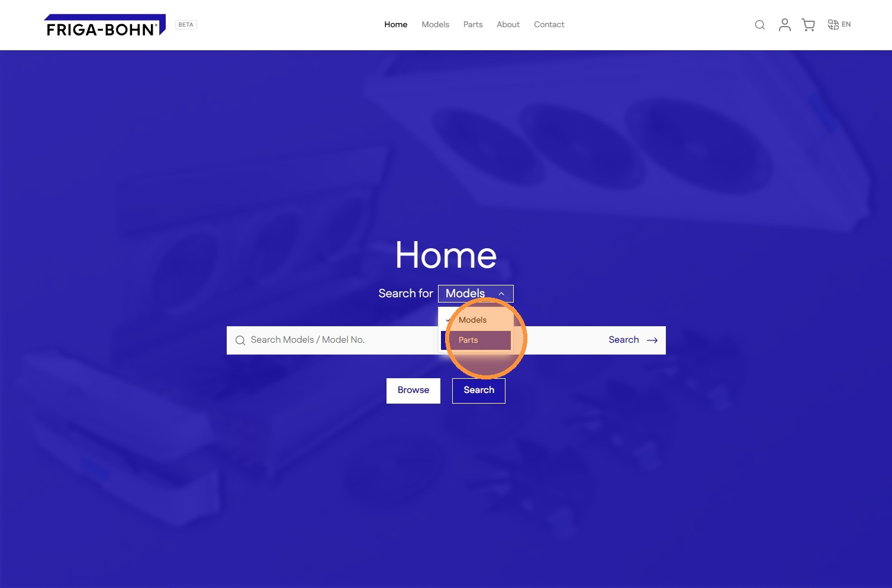
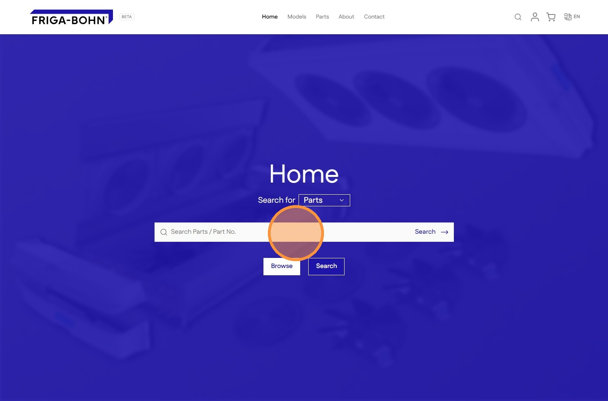
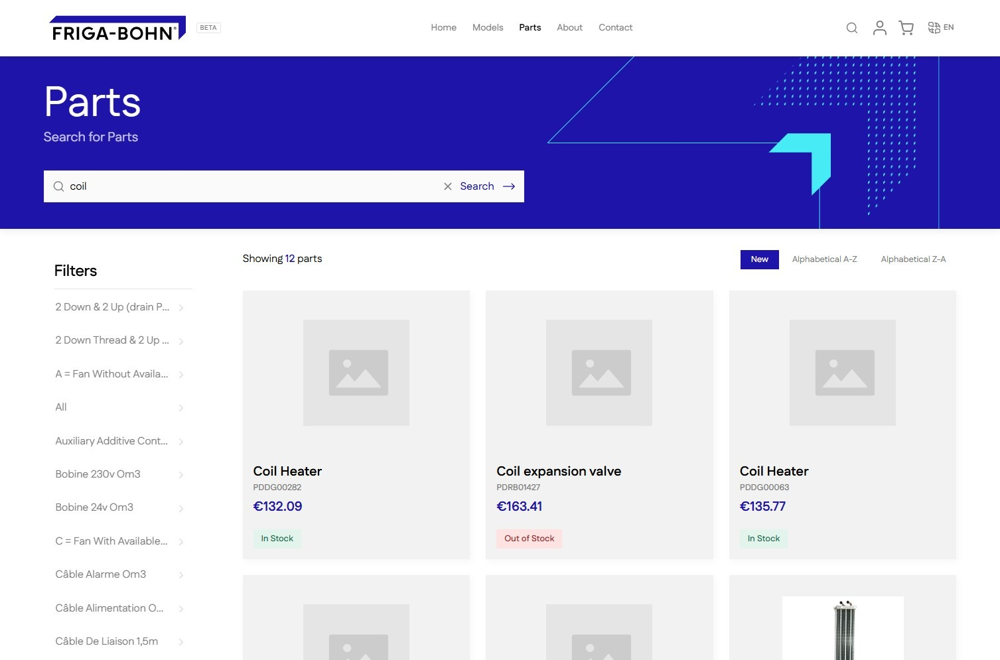

# How to Search for Parts on Your Shopify Store

Learn how to efficiently locate specific inventory items using the search functionality on your store front. This guide helps you navigate to the parts category and perform quick product searches to find the exact components you need.

1\. Navigate to **Home** page

2\. Click to open the **search selector**

3\. Click **Parts**

4\. Click the **Search box** field.

5\. Enter the search term followed by **Enter** or clicking the **Search button**

6\. This will take you to the **Parts** page with the search results

[Go back to Catalogue](../catalogue.md)