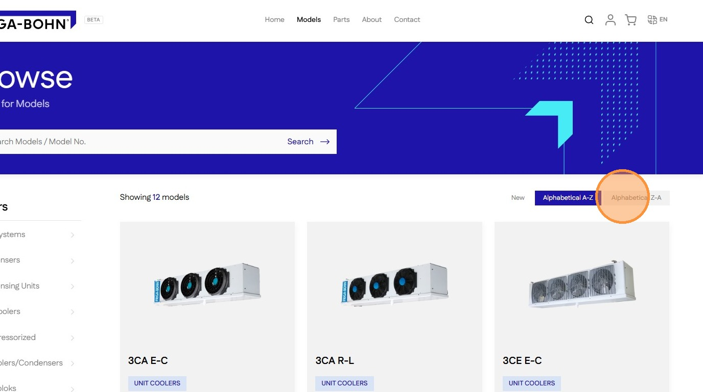
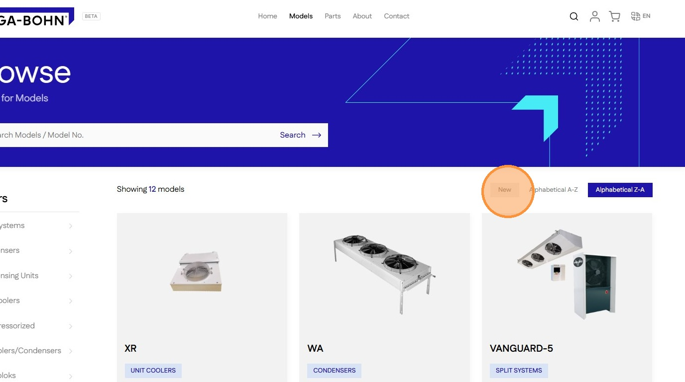

# How To Sort Products On The Shop Page

Learn how to efficiently organize your product listings by adjusting sort preferences. This guide helps you navigate between alphabetical and chronological views to find exactly what you are looking for quickly.

1\. Navigate to **Models** page

2\. Click **Alphabetical A-Z** to sort A-Z

3\. Click **Alphabetical Z-A** to sort Z-A

4\. Click **New** to return to default view

> ↑ [Go back to Catalogue](../catalogue.md)