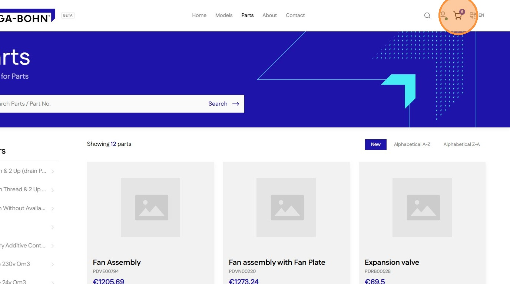
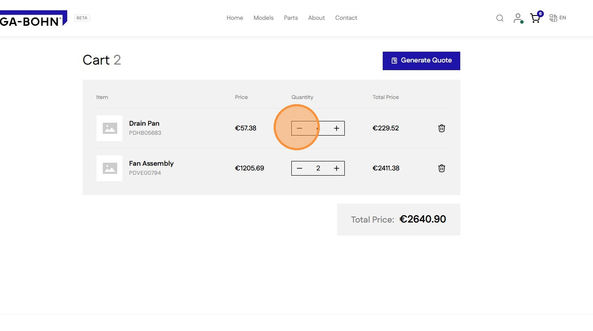
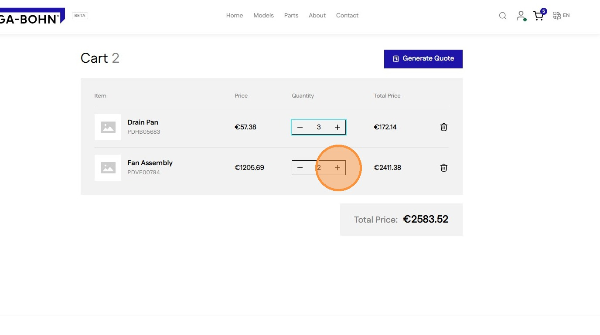
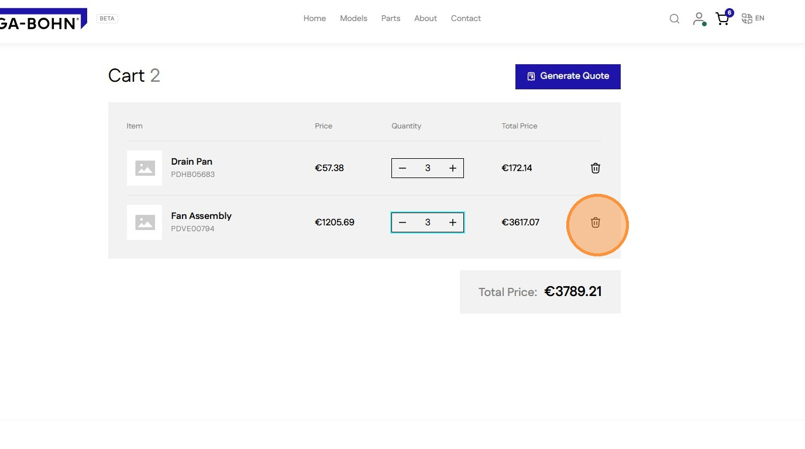
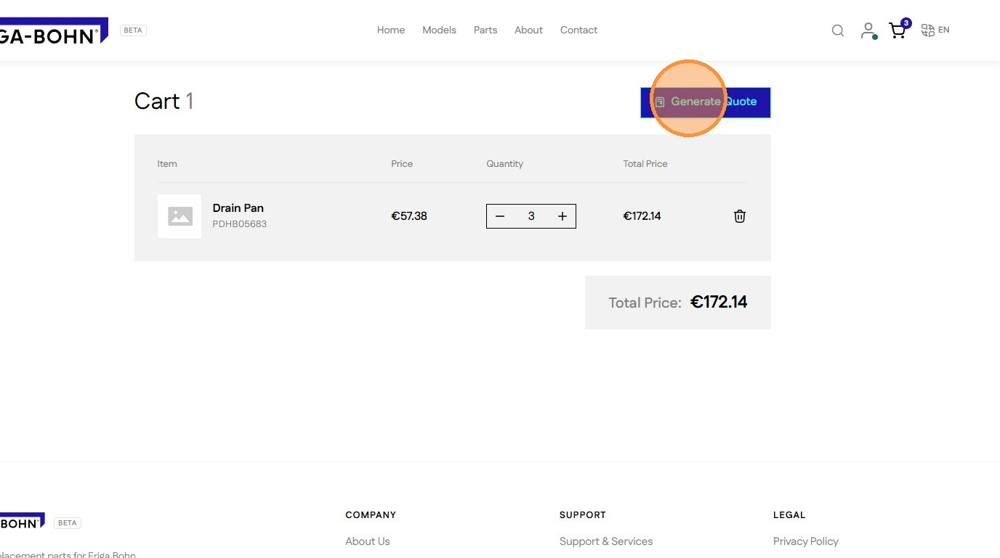

# How To Manage Cart and Generate A Quote

Learn the efficient process for creating custom quotes directly through your Shopify storefront. This guide walks you through each click required to finalize your request and receive pricing information.

1\. Click Cart icon to navigate to cart page

2\. use the **-** icon to reduce quantity

3\. use the **+** icon to increase quantity

4\. Click Bin icon to remove product from cart

5\. When ready Click **Generate Quote**  to convert cart in to a quote

> ↑ [Go back to Orders](../orders.md)
