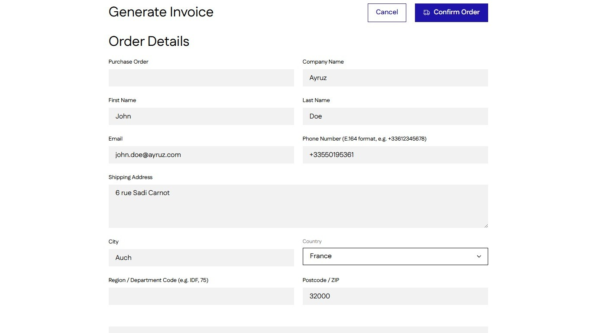
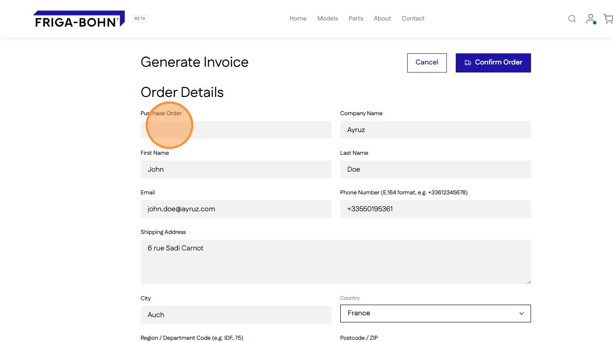
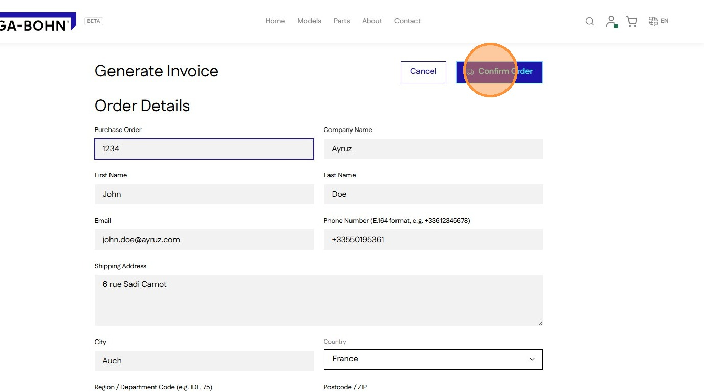
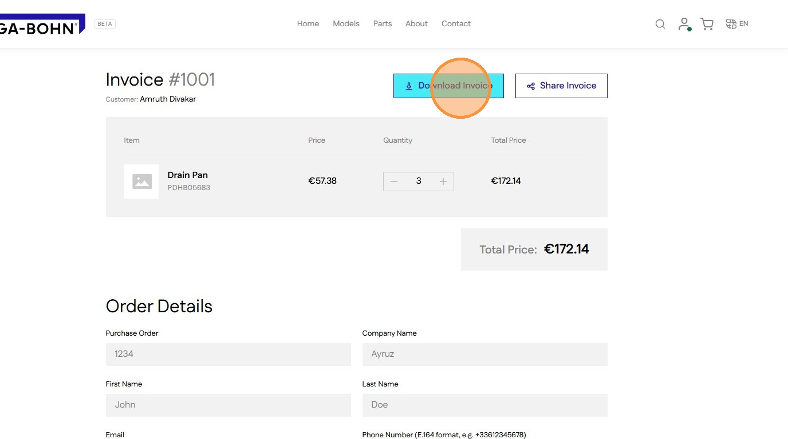
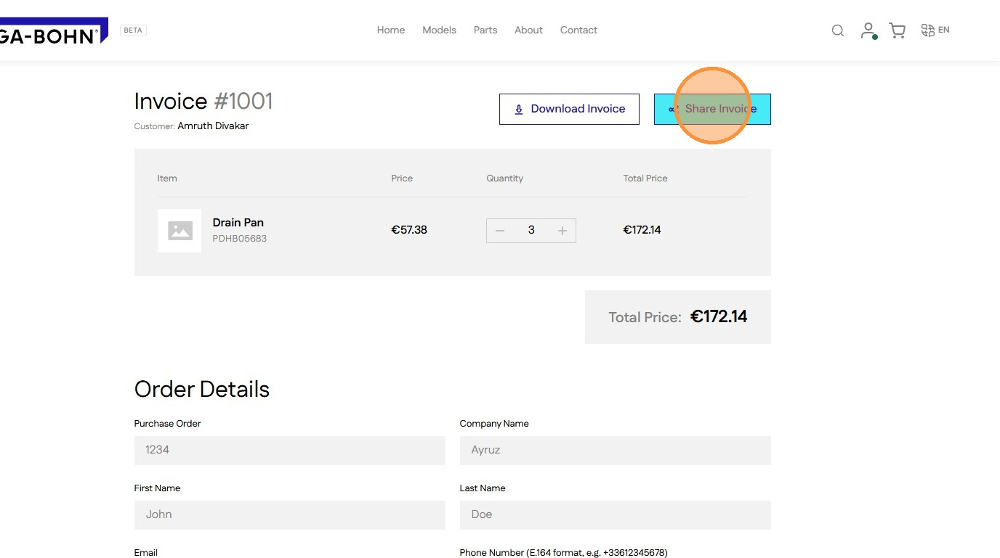

# How to Process and Share Your Quote Invoice

This guide demonstrates how to finalize a purchase order by inputting the necessary reference number and confirming the transaction. You will also learn how to quickly download or share your digital invoice for record-keeping purposes.

1\. Navigate to a **Quote** page

2\. Add the Purchase Order number. All other fields will be auto filled with the accounts default address. Update the address if needed.

3\. Click **Confirm Order**  button after filling the form and verifying quote to generate invoice

4\. Click **Download Invoice** to download the invoice PDF document

5\. Click **Share Invoice** to share a the invoice PDF document

> ↑ [Go back to Orders](../orders.md)